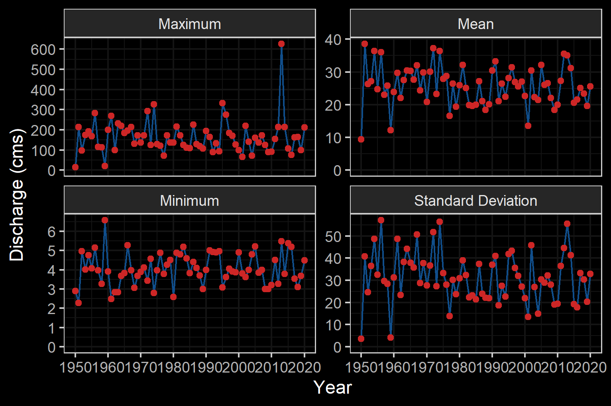

# Background
As a result of high-level direction from the provincial government, a Fish Passage Strategic Approach protocol has been developed for British Columbia to ensure that the greatest opportunities for restoration of fish passage are pursued.  A Fish Passage Technical Working Group has been formed to coordinate the protocol and data is continuously amalgamated within the Provincial Steam Crossing Inventory System (PSCIS).  The strategic approach protocol involves a four-phase process as described in @fishpassagetechnicalworkinggroupFishPassageStrategic2014 :

 * Phase 1: Fish Passage Assessment – Fish stream crossings within watersheds with high fish values are assessed to determine barrier status of structures and document a general assessment of adjacent habitat quality and quantity.
 * Phase 2: Habitat Confirmation – Assessments of crossings prioritized for follow up in Phase 1 studies are conducted to confirm quality and quantity of habitat upstream and down as well as to scope for other potential nearby barriers that could affect the practicality of remediation.
 * Phase 3: Design – Site plans and designs are drawn for priority crossings where high value fish habitat has been confirmed. 
 * Phase 4: Remediation – Reconnecting of isolated habitats through replacement, rehabilitation or removal of prioritized crossing structure barriers. 
 
  
<br>

The Canadian Wildlife Federation has been working on a watershed connectivity remediation plan for the Elk River watershed that incorporates the provincial Strategic Approach, evolution of the `bcfishpass` analysis tools and local knowledge of the watershed to prioritize barriers and restore connectivity for westslope cutthroat trout and other species in a strategic manner. Nupqu Resource Limited Partnership was retained to conduct fish passage assessments and habitat confirmations to fill data gaps in support of this work.


## Project Location

To focus the project within habitat considered high value for conservation of westslope cutthrout trout, the study area included the Elk River watershed group with a focus on basins that flow into the Elk River (Figure \@ref(fig:overview-map)). The Elk River has a mean annual discharge of `r round(fasstr::calc_longterm_mean(station_number = "08NK016")$LTMAD,1)` m^3^/s at station 08NK016 near Sparwood and `r round(fasstr::calc_longterm_mean(station_number = "08NK002")$LTMAD,1)` m^3^/s at station 08NK016 near Fernie with flow patterns typical of high elevation watersheds on the west side of the Rocky Mountains which receive large amounts of precipitation as snow leading to peak levels of discharge during snowmelt, typically from May to July (Figures \@ref(fig:hydrology-plot) - \@ref(fig:hydrology-stats2)) [@canada2020NationalWater]. 

<br>

```{r overview-map, fig.cap = 'Overview map of Study Area',eval=T}
knitr::include_graphics("fig/Overview_ELKR.png")
```

<br>

```{r hydrology-plot, fig.cap = 'Hydrograph for Elk River near Sparwood (Station #08NK016) and near Fernie (Station #08NK002).', fig.show="hold", out.width= c("49.5%","1%","49.5%"), eval=T}
knitr::include_graphics("fig/hydrograph_08NK016.png")
knitr::include_graphics("fig/pixel.png")

```

<br>

```{r hydrology-stats1, fig.cap = 'Elk River Near Sparwood (Station #08NK016 - Lat 49.86562 Lon -114.86868). Available daily discharge data from 1950 to 2020.', eval=T}

```

<br>

```{r hydrology-stats2, fig.cap = 'Elk River At Fernie (Station #08NK002 - Lat 49.50347 Lon -115.07013). Available daily discharge data from 1970 to 2020.', eval=T}

knitr::include_graphics("fig/hydrology_stats_08NK002.png")

```


`r if(gitbook_on){knitr::asis_output("<br>")} else knitr::asis_output("<br><br><br><br>")`

### Ktunaxa Nation

The project location is within the traditional territory of the Ktunaxa Nation [@KtunaxaNation2020] with Elk River components within an area known as Qukin ʔamakʔis, or Raven’s Land [@ministryofforests2020ElkValley]. When Europeans settled in the Kootenay Region around 200 hundred years ago, the Indian Reserves were created which lead to the seven Indian Bands:

 * ʔakisq̓nuk- Columbia Lake Band (Windermere, BC);
 * ʔaq̓am- St. Mary's Band (Cranbrook, BC);
 * ʔakink̓umǂasnuqǂiʔit- Tobacco Plains Band (Grasmere, BC);
 * yaqan nuʔkiy- Lower Kootenay Band (Creston, BC);
 * kyaknuqǂiʔit- Shuswap Band (Invermere, BC);
 * ʔaq̓anqmi- Kootenai Tribe of Idaho (Bonners Ferry, Idaho);
 * k̓upawi¢q̓nuk- Ksanka Band (Elmo, Montana)

<br>

@KtunaxaNation2020 report the vision statement of the Ktunaxa as:

<br>

"Kȼmak̓qa ksukⱡuⱡa·k kuk̓qani ȼ k̓itqakiⱡ haqa ksiʔⱡ ȼxa ʔa·kⱡukqaʔis ksukiⱡq̓ukaʔmi·k kiʔin Ktunaxa naʔs ʔamak̓ʔis. Qus pik̓aksȼ naʔs ȼxaⱡ yaqanakiⱡ haqaʔki. K̓itqawiȼmu kakiⱡwiȼkiⱡ ʔamakʔis k̓isnikȼik kȼxaⱡ qa kiⱡkk̓axuxami·k k̓itqakiⱡ haqa ȼ k̓isʔin ʔaknumuȼtiⱡʔis."

<br>

The vision statement has been translated to english as:

<br>

"Strong, healthy citizens and communities, speaking our languages and celebrating who we are and our history in our ancestral homelands, working together, managing our lands and resources, within a self-sufficient, self-governing Nation."


<br>

### Elk Valley Cumulative Effects Management Framework

```{r eval=FALSE}
# Coal deposits are located in the Elk River and Flathead coalfields which extend fromthe Canada-USA border to the northwest for 175km along the Rocky Mountains with cumulative coal thickness ranging up to 70m. Subsurface resource exploration and develpment is prohibited in the Flathead River watershed due to legislation enacted in 2011.  At the time of reporting there were four active coal mines in the Elk River watershed (Fording River, Greenhills, Line Creek and Elkview), one closed mine (Coal Mountain) as well as multiple exploration projects and proposed new mines [@ministryofenergy2020EastKootenay].

```


First Nations, stakeholders, proponents and provincial and municipal governments have recognized that the region has been impacted by historic and current coal operations as well as other stresses such as forestry operations, wildfire, residential development, recreational activities and transportation.  To assess the historic, current and potential future conditions of valued ecosystem components and to support resource management decisions within the region, the Provincial Cumulative Effects Framework and the Elk Valley Cumulative Effects Management Framework (EV-CEMF) have been formed under joint management between the Ktunaxa Nation Council and the B.C. Ministry of Forests, Lands, Natural Resource Operations and Rural Development (FLNRORD). A working group consisting of the Ktunaxa Nation Council, industry, community, organizations, and provincial government ministries has been formed to provide guidance and oversight for EV-CEMF activities.  Valued component technical reports for Grizzly Bear, Riparian and westslope cutthroat trout [@davidson_etal2018AquaticEcosystems], bighorn sheep, and old and mature forest have been drafted, integrated into an overarching Cumulative Effects Assessment and Management Report [@elkvalleycumulativeeffectsmanagementframeworkworkinggroup2018ElkValley] and endorsed by the Working Group. These reports describe the historical, current, and future assessment of cumulative effects in the Elk Valley and provide management and mitigation recommendations. Next steps for the framework include the development of an Implementation Plan to identify priority actions and spatial locations to focus management and mitigation of cumulative effects in the valley which may include actions to address aquatic habitat connectivity issues [@ministryofforests2020ElkValley].

<br>

## Fisheries

Fish species recorded in the Elk River watershed group are detailed in Table \@ref(tab:fiss-species-table) [@data_fish_obs].  Bull trout and westslope cutthrout trout are considered of special concern (blue-listed) provincially and westslope cutthrout trout (Pacific populations) are are listed under the *Species at Risk Act* by the Committee on the Status of Endangered Wildlife in Canada as a species of special concern [@bcspeciesecosystemexplorer2020Salvelinusconfluentusa; @bcspeciesecosystemexplorer2020Oncorhynchusclarkii; @schweigert_etal2017COSEWICassessment].  The focus of 2020 field work was to assess potential impacts of road-stream crossings on habitat connectivity for westslope cutthrout trout.

<br>

```{r fiss-species-table}
fiss_species_table <- readr::read_csv(file = paste0(getwd(), '/data/inputs_extracted/02_prep_report/fiss_species_table.csv'))
  # filter(`Species Code` != 'CT') %>% 
fiss_species_table %>%  
  rename(Elk = `Upper Elk`) %>% 
  my_kable(caption_text = 'Fish species recorded in the study area (FISS 2020).')


```

<br>

### Westslope Cutthrout Trout

There are multiple life history strategies for westslope cutthrout trout including stream-resident, fluvial and adfluvial.  All have habitat requirements during life history stages that include cold clean water and varied forms of cover (undercut banks, pool-riffle habitat and riparian vegetation).  Stream-resident fish inhabitat headwater streams above barriers, complete their life cycle within a relatively small range and typically remain relatively small (i.e. <200mm in length).  Fluvial fish are migratory subpopulations that migrate between small spawning/rearing tributaries and larger adult rearing rivers. Lengths of fluvial fish generally reach more than 400mm.  Finally, adfluvial subpopulations  rear in lakes and migrate to spawning/rearing tributaries with lengths often exceeding 500mm [@schweigert_etal2017COSEWICassessment].


<br>

Spawning habitat for resident and fluvial subpopulations are documented as within the tailouts of deep pools at moderate to high-flow events within small, low-gradient streams with cold well-oxygenated water and clean unsilted gravels [@schmetterling2001SeasonalMovements]. Proximity to large woody debris, boulder or bedrock cover is important for spawning fish while residing in spawning tributaries as high mortality may result when suitable cover is lacking.  The dominant substrate used for spawning is gravel (1.8 - 3.3cm diameter) with spawning occurring in late May and June towards the end of the spring freshet with rising water temperatures between 7-11$^\circ$C.  Nine of 11 westslope cutthrout trout radio-tagged in the Blackfoot River drainage, Montana by @schmetterling2001SeasonalMovements made movements to tributaries presumable for spawning. While in tributaries, fish movements to spawning sites averaged 12.5km where they stayed within an approximately 100m reach during the spawning period for between 15 and 63 days.

<br>

Small perennial streams with a diversity of cover are important for juvenile rearing with young-of-year fish inhabiting low energy lateral habitats (i.e. shallow riffle or backwatered areas) with cover available.  Larger juveniles move into pools with social dominance behaviors prevalent and based on fish size.  Availability of pool habitat is important and limiting for parr which have large territories [@schweigert_etal2017COSEWICassessment; @schmetterling2001SeasonalMovements].  The suitability of overwintering habitat is determined by groundwater influx and the absence of anchor ice with fluvial adults congregating in slow deep pools in the winter.  Boulders and other large in-stream structures or off-channel habitat (beaver bonds and sloughs) provide cover for juveniles with adfluvial fish overwintering in lakes [@schweigert_etal2017COSEWICassessment; @brown_mackay1995Spawningecology; @cope_etal2017UpperFording]. 

<br>


In a swimming performance study conducted in an open-channel flume @blank_etal2020SwimmingPerformance estimated the overall average swim speeds of westlope cutthrout trout (150mm - 290mm in length) at 0.84m/s with a maximum observed swim speed of 3.55m/s. 

<br>

The greatest threats to westslope cutthrout trout are hybridization with non-native rainbow trout and degradation of the environment due to forestry, hydroelectric development, mining, urbanization and agriculture [@schweigert_etal2017COSEWICassessment]. @lamson2020EvaluationCurrent sampled over 2000 trout in the Upper Kootenay watershed from 2014 to 2019 with results of genotyping indicating consistently high levels of westslope cutthrout trout allele purity (i.e. very low levels of rainbow trout, yellowstone cutthrout trout or coastal cutthrout trout genetic introgression) throughout the Elk River watershed areas upstream of the Elko Dam. @boyer_etal2008Rainbowtrout sampled 31 sites in the upper Flathead River system within the United States (27 sites) and Canada (4 sites).  Genetic introgression declined with latitude with no evidence of rainbow trout allelles within any westslope cutthrout trout sampled within the Canadian portion of the upper Flathead River.  

<br>

```{r fish-wct-fiss-summary}
# load the csv built with R/02_prep_fig/analyze_fish_wct.R
wct_elkr_grad <- readr::read_csv(file = paste0(getwd(), '/data/inputs_extracted/02_prep_report/wct_elkr_grad.csv'))
```


Gradient of streams is an important determinant of habitat suitability for salmonids with lower gradient habitats often providing the most productive environments for both rearing and spawning while high gradient sections typically  present  upstream  migration  barriers  and  less  available  habitat.  A summary of historic westslope cutthrout trout observations in the Elk River watershed group delineated by average gradient category of associated stream segments where they were captured is provided in Figure \@ref(fig:fish-wct-bar). Of `r wct_elkr_grad %>% filter(gradient_id == 3) %>% pull(total)` observations, `r wct_elkr_grad %>% filter(gradient_id == 3) %>% pull(Percent) + wct_elkr_grad %>% filter(gradient_id == 5) %>% pull(Percent) + wct_elkr_grad %>% filter(gradient_id == 8) %>% pull(Percent)`% were within stream segments with average gradients ranging from 0 - 8%.  A total of `r wct_elkr_grad %>% filter(gradient_id == 3) %>% pull(Percent)`% of historic observations were within stream segments with gradients between 0 - 3%, `r wct_elkr_grad %>% filter(gradient_id == 5) %>% pull(Percent)`% were within stream segments with gradients ranging from 3 - 5% and `r wct_elkr_grad %>% filter(gradient_id == 8) %>% pull(Percent)`% were within stream segments with gradients between 5 - 8% [@data_fish_obs; @norris2020bcfishobs]. 

<br>

```{r fish-wct-bar, out.width = photo_width, fig.cap= 'Summary of historic westslope cutthrout trout observations vs. stream gradient category.'}
##bar graph
plot_wct_elkr_grad <- wct_elkr_grad %>% 
  ggplot(aes(x = Gradient, y = Percent)) +
  geom_bar(stat = "identity")+
  theme_bw(base_size = 12)+
  labs(x = "Stream Gradient", y = "WCT Occurrences (%)") +
  ggdark::dark_theme_bw()
plot_wct_elkr_grad

```


