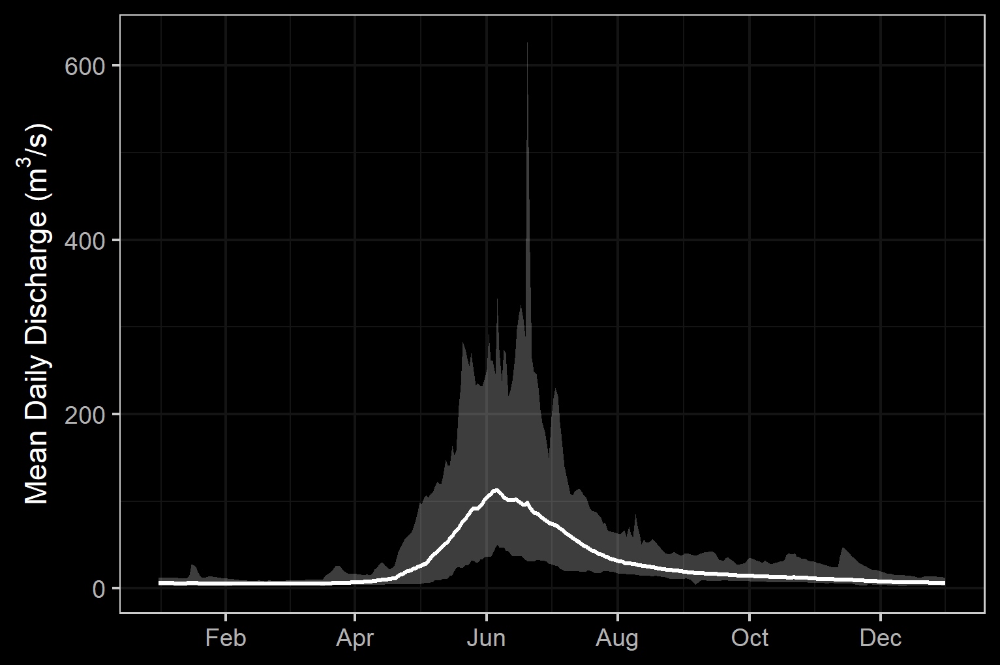
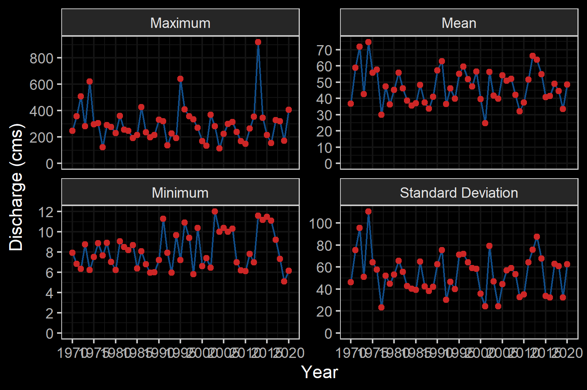

--- 
title: "Elk River Watershed Group Fish Passage Restoration Planning 2021"
author: |
 |
 |
 | Prepared for
 | Nupqu Resource Limited Partnership
 |
 |
 | Prepared by
 | Al Irvine, B.Sc., R.P.Bio.
 | New Graph Environment Ltd.

date: |
 |
 | Version 1.0.2
 | `r format(Sys.Date(), "%Y-%m-%d")`
toc-title: Table of Contents
site: bookdown::bookdown_site
output: 
  bookdown::gitbook:
          includes:
            in_header: header.html
nocite: |

documentclass: book
bibliography: [book.bib, references.bib, packages.bib]
biblio-style: apalike
link-citations: no
github-repo: rstudio/bookdown-demo
description: "2021 Reporting for Fish Passage Restoration Planning Assessments in the Elk River watershed group."

---


```{r switch-gitbook-pagedown, echo=FALSE}
gitbook_on <- TRUE
# gitbook_on <- FALSE  ##we just need turn  this on and off to switch between gitbook and pdf via paged.js

```


```{r setup, echo=identical(gitbook_on, TRUE), include = TRUE}
knitr::opts_chunk$set(echo=identical(gitbook_on, TRUE), message=FALSE, warning=FALSE, dpi=60, out.width = "100%")
# knitr::knit_hooks$set(webgl = hook_webgl)
options(scipen=999)
options(knitr.kable.NA = '--') #'--'
options(knitr.kable.NAN = '--')
```

```{r load-data}
source('R/packages.R')
source('R/functions.R')
source('R/private_info.R')
source('R/tables.R')
```


```{r settings-gitbook, eval= gitbook_on}
photo_width <- "100%"
font_set <- 11

```

```{r settings-paged-html, eval= identical(gitbook_on, FALSE)}
photo_width <- "80%"
font_set <- 9
```


```{r include=FALSE}
# automatically create a bib database for R packages
knitr::write_bib(c(
  .packages(), 'bookdown', 'knitr', 'rmarkdown'
), 'packages.bib')
```

# Acknowledgement {.front-matter .unnumbered}


Modern civilization has a long journey ahead to acknowledge and address the historic and ongoing impacts of colonialism that have resulted in harm to the cultures and livelihoods of those that have lived in harmony with the land for many thousands of years. That harm extends naturally to the ecosystems themselves. 


```{js, logo-header, echo = FALSE, eval= T}
title=document.getElementById('header');
title.innerHTML = '' + title.innerHTML
```


<!--chapter:end:index.Rmd-->


# Executive Summary {.front-matter .unnumbered} 

Nupqu Resource Limited Partnership was retained by the Canadian Wildlife Federation in the summer of 2021 to conduct fish passage and habitat confirmation assessments at road-stream crossings and dams within the Elk River watershed group as part of connectivity restoration planning targeting westslope cutthrout trout. New Graph Environment Ltd. was sub-contracted by Nupqu to assist with project delivery. The assessments conducted in 2021 complement work completed in 2020 which can be viewed interactively online at https://newgraphenvironment.github.io/fish_passage_elk_2020_reporting_cwf/ [@irvine2021UpperElk].
`r if(identical(gitbook_on, FALSE))knitr::asis_output("This report is available as pdf and as an online interactive report at https://newgraphenvironment.github.io/fish_passage_elk_2021_reporting/. Viewing online is recommended as the web-hosted version contains more features and is more easily navigable.")` 


<br>


The health and viability of freshwater fish populations can depend on access to tributary and off channel areas which provide refuge during high flows, opportunities for foraging, overwintering habitat, spawning habitat and summer rearing habitat [@Bramblett_2002; @swalesRoleOffChannelPonds1989; @diebel_etal2015EffectsRoad].  Culverts can present barriers to fish migration due to low water depth, increased water velocity, turbulence, a vertical drop at the culvert outlet and/or maintenance issues [@slaneyFishHabitatRehabilitation1997; @cote_etal2005Fishpassage].  Also of relevance to aquatic connectivity, there are a multitude of dam structures historically installed throughout the province for numerous purposes such as water extraction and hydropower generation. 


<br>


In 2021, fish passage assessments were conducted at `r pscis_phase1 %>% nrow()` stream crossing sites with `r pscis_phase1 %>% filter(barrier_result == 'Passable') %>% nrow()` crossings considered "passable", `r pscis_phase1 %>% filter(barrier_result == 'Potential') %>% nrow() %>% english::as.english()` crossing considered "potential" barriers and `r pscis_phase1 %>% filter(barrier_result == 'Barrier') %>% nrow() ` crossing considered "barriers" according to threshold values based on culvert embedment, outlet drop, slope, diameter (relative to channel size) and length [@fish_passage_assessments].  Additionally, although all were considered fully passable, `r pscis_phase1 %>% filter(barrier_result == 'Unknown') %>% nrow() %>% english::as.english()` crossings assessed were fords and thus assigned "unknown" status according to the provincial protocol. In addition, three historic dam locations were assessed for fish passage including sites on `r tab_dams_raw %>% arrange(id) %>% pull(stream) %>% knitr::combine_words()`.

<br>

In 2021, habitat confirmation assessments were conducted at `r hab_site_priorities %>% nrow()` sites in the Elk River watershed group with a total of approximately `r habitat_confirmations_priorities %>% pull(survey_length_m) %>% sum() %>% round(-3)/1000`km of stream surveyed. As these assessments are intended to supplement data and insights from numerous other programs underway in the region and because collaborative decision making was ongoing at the time of reporting, site prioritization can be considered preliminary and a starting point for discussions with connectivity partners, stakeholders and industry/regulatory professionals.  `r hab_site_priorities %>% filter(priority %ilike% 'high') %>% nrow() %>% english::as.english() %>% str_to_title()` crossings were rated as high priorities for proceeding to design for replacement, `r hab_site_priorities %>% filter(priority %ilike% 'Moderate') %>% nrow() %>% english::as.english()` crossings were rated as moderate priorities, and `r hab_site_priorities %>% filter(priority %ilike% 'Low') %>% nrow() %>% english::as.english()` crossings were rated as low priorities.  Only summary tables and raw data are provided for surveys conducted within the Flathead River sub-basin with additional reporting potentially provided for these sites in the future under separate cover. Detailed information for each site assessed with Phase 2 assessments on streams that drain into the Elk River are presented within site specific appendices to this document.  In addition, fish passage assessments of dams located on `r tab_dams_raw %>% arrange(id) %>% pull(stream) %>% knitr::combine_words()` were conducted with results presented within the "Results and Discussion" section. 

<br>

Effective connectivity restoration planning incorporates a watershed based approach and develops an understanding of subject aquatic systems to a level where actions prioritized are highly likely to address limiting factors and increase the productivity of local fish populations. Leveraging of research initiatives in the region as well as baseline and follow up monitoring is important to foster this understanding in the Elk River watershed group where there are opportunities to restore connectivity by ensuring that fish passage considerations are incorporated into repair, replacement, relocation and deactivation designs for both stream crossing barrier and dam barrier structures.


<!--chapter:end:0040-executive_summary.Rmd-->


# Introduction {#intro}

Nupqu Resource Limited Partnership (Nupqu) was retained by the Canadian Wildlife Federation in the summer of 2021 to conduct fish passage and habitat confirmation assessments at road-stream crossings and dams within the Elk River watershed group as part of connectivity restoration planning targeting westslope cutthrout trout. New Graph Environment Ltd. was sub-contracted by Nupqu to assist with project delivery. The assessments conducted in 2021 complement work completed in 2020 (72 fish passage assessments and 15 habitat confirmation assessments) which can be viewed interactively online at https://newgraphenvironment.github.io/fish_passage_elk_2020_reporting_cwf/ [@irvine2021UpperElk].
`r if(identical(gitbook_on, FALSE))knitr::asis_output("This report is available as pdf and as an online interactive report at https://newgraphenvironment.github.io/fish_passage_elk_2021_reporting/. Viewing online is recommended as the web-hosted version contains more features and is more easily navigable.")` 


<br>


The health and viability of freshwater fish populations can depend on access to tributary and off channel areas which provide refuge during high flows, opportunities for foraging, overwintering habitat, spawning habitat and summer rearing habitat [@Bramblett_2002; @swalesRoleOffChannelPonds1989; @diebel_etal2015EffectsRoad].  Culverts can present barriers to fish migration due to low water depth, increased water velocity, turbulence, a vertical drop at the culvert outlet and/or maintenance issues [@slaneyFishHabitatRehabilitation1997; @cote_etal2005Fishpassage].  Also of relevance to aquatic connectivity, there are a multitude of dam structures historically installed throughout the province for numerous purposes such as water extraction and hydropower generation. There are numerous opportunities to restore connectivity by ensuring that fish passage considerations are incorporated into repair, replacement, relocation and deactivation designs for both stream crossing barrier and dam barrier structures.  


<!--chapter:end:0100-intro.Rmd-->


# Background
As a result of high-level direction from the provincial government, a Fish Passage Strategic Approach protocol has been developed for British Columbia to ensure that the greatest opportunities for restoration of fish passage are pursued.  A Fish Passage Technical Working Group has been formed to coordinate the protocol and data is continuously amalgamated within the Provincial Steam Crossing Inventory System (PSCIS).  The strategic approach protocol involves a four-phase process as described in @fishpassagetechnicalworkinggroupFishPassageStrategic2014 :

 * Phase 1: Fish Passage Assessment – Fish stream crossings within watersheds with high fish values are assessed to determine barrier status of structures and document a general assessment of adjacent habitat quality and quantity.
 * Phase 2: Habitat Confirmation – Assessments of crossings prioritized for follow up in Phase 1 studies are conducted to confirm quality and quantity of habitat upstream and down as well as to scope for other potential nearby barriers that could affect the practicality of remediation.
 * Phase 3: Design – Site plans and designs are drawn for priority crossings where high value fish habitat has been confirmed. 
 * Phase 4: Remediation – Reconnecting of isolated habitats through replacement, rehabilitation or removal of prioritized crossing structure barriers. 
 
  
<br>

The Canadian Wildlife Federation has been working on a watershed connectivity remediation plan for the Elk River watershed that incorporates the provincial Strategic Approach, evolution of the `bcfishpass` analysis tools and local knowledge of the watershed to prioritize barriers and restore connectivity for westslope cutthroat trout and other species in a strategic manner. Nupqu Resource Limited Partnership was retained to conduct fish passage assessments and habitat confirmations to fill data gaps in support of this work.


## Project Location

To focus the project within habitat considered high value for conservation of westslope cutthrout trout, the study area included the Elk River watershed group with a focus on basins that flow into the Elk River (Figure \@ref(fig:overview-map)). The Elk River has a mean annual discharge of `r round(fasstr::calc_longterm_mean(station_number = "08NK016")$LTMAD,1)` m^3^/s at station 08NK016 near Sparwood and `r round(fasstr::calc_longterm_mean(station_number = "08NK002")$LTMAD,1)` m^3^/s at station 08NK016 near Fernie with flow patterns typical of high elevation watersheds on the west side of the Rocky Mountains which receive large amounts of precipitation as snow leading to peak levels of discharge during snowmelt, typically from May to July (Figures \@ref(fig:hydrology-plot) - \@ref(fig:hydrology-stats2)) [@canada2020NationalWater]. 

<br>

```{r overview-map, fig.cap = 'Overview map of Study Area',eval=T}
knitr::include_graphics("fig/Overview_ELKR.png")
```

<br>

```{r hydrology-plot, fig.cap = 'Hydrograph for Elk River near Sparwood (Station #08NK016) and near Fernie (Station #08NK002).', fig.show="hold", out.width= c("49.5%","1%","49.5%"), eval=T}

knitr::include_graphics("fig/pixel.png")
knitr::include_graphics("fig/hydrograph_08NK002.png")
```

<br>

```{r hydrology-stats1, fig.cap = 'Elk River Near Sparwood (Station #08NK016 - Lat 49.86562 Lon -114.86868). Available daily discharge data from 1950 to 2020.', eval=T}
knitr::include_graphics("fig/hydrology_stats_08NK016.png")
```

<br>

```{r hydrology-stats2, fig.cap = 'Elk River At Fernie (Station #08NK002 - Lat 49.50347 Lon -115.07013). Available daily discharge data from 1970 to 2020.', eval=T}



```


`r if(gitbook_on){knitr::asis_output("<br>")} else knitr::asis_output("<br><br><br><br>")`

### Ktunaxa Nation

The project location is within the traditional territory of the Ktunaxa Nation [@KtunaxaNation2020] with Elk River components within an area known as Qukin ʔamakʔis, or Raven’s Land [@ministryofforests2020ElkValley]. When Europeans settled in the Kootenay Region around 200 hundred years ago, the Indian Reserves were created which lead to the seven Indian Bands:

 * ʔakisq̓nuk- Columbia Lake Band (Windermere, BC);
 * ʔaq̓am- St. Mary's Band (Cranbrook, BC);
 * ʔakink̓umǂasnuqǂiʔit- Tobacco Plains Band (Grasmere, BC);
 * yaqan nuʔkiy- Lower Kootenay Band (Creston, BC);
 * kyaknuqǂiʔit- Shuswap Band (Invermere, BC);
 * ʔaq̓anqmi- Kootenai Tribe of Idaho (Bonners Ferry, Idaho);
 * k̓upawi¢q̓nuk- Ksanka Band (Elmo, Montana)

<br>

@KtunaxaNation2020 report the vision statement of the Ktunaxa as:

<br>

"Kȼmak̓qa ksukⱡuⱡa·k kuk̓qani ȼ k̓itqakiⱡ haqa ksiʔⱡ ȼxa ʔa·kⱡukqaʔis ksukiⱡq̓ukaʔmi·k kiʔin Ktunaxa naʔs ʔamak̓ʔis. Qus pik̓aksȼ naʔs ȼxaⱡ yaqanakiⱡ haqaʔki. K̓itqawiȼmu kakiⱡwiȼkiⱡ ʔamakʔis k̓isnikȼik kȼxaⱡ qa kiⱡkk̓axuxami·k k̓itqakiⱡ haqa ȼ k̓isʔin ʔaknumuȼtiⱡʔis."

<br>

The vision statement has been translated to english as:

<br>

"Strong, healthy citizens and communities, speaking our languages and celebrating who we are and our history in our ancestral homelands, working together, managing our lands and resources, within a self-sufficient, self-governing Nation."


<br>

### Elk Valley Cumulative Effects Management Framework

```{r eval=FALSE}
# Coal deposits are located in the Elk River and Flathead coalfields which extend fromthe Canada-USA border to the northwest for 175km along the Rocky Mountains with cumulative coal thickness ranging up to 70m. Subsurface resource exploration and develpment is prohibited in the Flathead River watershed due to legislation enacted in 2011.  At the time of reporting there were four active coal mines in the Elk River watershed (Fording River, Greenhills, Line Creek and Elkview), one closed mine (Coal Mountain) as well as multiple exploration projects and proposed new mines [@ministryofenergy2020EastKootenay].

```


First Nations, stakeholders, proponents and provincial and municipal governments have recognized that the region has been impacted by historic and current coal operations as well as other stresses such as forestry operations, wildfire, residential development, recreational activities and transportation.  To assess the historic, current and potential future conditions of valued ecosystem components and to support resource management decisions within the region, the Provincial Cumulative Effects Framework and the Elk Valley Cumulative Effects Management Framework (EV-CEMF) have been formed under joint management between the Ktunaxa Nation Council and the B.C. Ministry of Forests, Lands, Natural Resource Operations and Rural Development (FLNRORD). A working group consisting of the Ktunaxa Nation Council, industry, community, organizations, and provincial government ministries has been formed to provide guidance and oversight for EV-CEMF activities.  Valued component technical reports for Grizzly Bear, Riparian and westslope cutthroat trout [@davidson_etal2018AquaticEcosystems], bighorn sheep, and old and mature forest have been drafted, integrated into an overarching Cumulative Effects Assessment and Management Report [@elkvalleycumulativeeffectsmanagementframeworkworkinggroup2018ElkValley] and endorsed by the Working Group. These reports describe the historical, current, and future assessment of cumulative effects in the Elk Valley and provide management and mitigation recommendations. Next steps for the framework include the development of an Implementation Plan to identify priority actions and spatial locations to focus management and mitigation of cumulative effects in the valley which may include actions to address aquatic habitat connectivity issues [@ministryofforests2020ElkValley].

<br>

## Fisheries

Fish species recorded in the Elk River watershed group are detailed in Table \@ref(tab:fiss-species-table) [@data_fish_obs].  Bull trout and westslope cutthrout trout are considered of special concern (blue-listed) provincially and westslope cutthrout trout (Pacific populations) are are listed under the *Species at Risk Act* by the Committee on the Status of Endangered Wildlife in Canada as a species of special concern [@bcspeciesecosystemexplorer2020Salvelinusconfluentusa; @bcspeciesecosystemexplorer2020Oncorhynchusclarkii; @schweigert_etal2017COSEWICassessment].  The focus of 2020 field work was to assess potential impacts of road-stream crossings on habitat connectivity for westslope cutthrout trout.

<br>

```{r fiss-species-table}
fiss_species_table <- readr::read_csv(file = paste0(getwd(), '/data/inputs_extracted/02_prep_report/fiss_species_table.csv'))
  # filter(`Species Code` != 'CT') %>% 
fiss_species_table %>%  
  rename(Elk = `Upper Elk`) %>% 
  my_kable(caption_text = 'Fish species recorded in the study area (FISS 2020).')


```

<br>

### Westslope Cutthrout Trout

There are multiple life history strategies for westslope cutthrout trout including stream-resident, fluvial and adfluvial.  All have habitat requirements during life history stages that include cold clean water and varied forms of cover (undercut banks, pool-riffle habitat and riparian vegetation).  Stream-resident fish inhabitat headwater streams above barriers, complete their life cycle within a relatively small range and typically remain relatively small (i.e. <200mm in length).  Fluvial fish are migratory subpopulations that migrate between small spawning/rearing tributaries and larger adult rearing rivers. Lengths of fluvial fish generally reach more than 400mm.  Finally, adfluvial subpopulations  rear in lakes and migrate to spawning/rearing tributaries with lengths often exceeding 500mm [@schweigert_etal2017COSEWICassessment].


<br>

Spawning habitat for resident and fluvial subpopulations are documented as within the tailouts of deep pools at moderate to high-flow events within small, low-gradient streams with cold well-oxygenated water and clean unsilted gravels [@schmetterling2001SeasonalMovements]. Proximity to large woody debris, boulder or bedrock cover is important for spawning fish while residing in spawning tributaries as high mortality may result when suitable cover is lacking.  The dominant substrate used for spawning is gravel (1.8 - 3.3cm diameter) with spawning occurring in late May and June towards the end of the spring freshet with rising water temperatures between 7-11$^\circ$C.  Nine of 11 westslope cutthrout trout radio-tagged in the Blackfoot River drainage, Montana by @schmetterling2001SeasonalMovements made movements to tributaries presumable for spawning. While in tributaries, fish movements to spawning sites averaged 12.5km where they stayed within an approximately 100m reach during the spawning period for between 15 and 63 days.

<br>

Small perennial streams with a diversity of cover are important for juvenile rearing with young-of-year fish inhabiting low energy lateral habitats (i.e. shallow riffle or backwatered areas) with cover available.  Larger juveniles move into pools with social dominance behaviors prevalent and based on fish size.  Availability of pool habitat is important and limiting for parr which have large territories [@schweigert_etal2017COSEWICassessment; @schmetterling2001SeasonalMovements].  The suitability of overwintering habitat is determined by groundwater influx and the absence of anchor ice with fluvial adults congregating in slow deep pools in the winter.  Boulders and other large in-stream structures or off-channel habitat (beaver bonds and sloughs) provide cover for juveniles with adfluvial fish overwintering in lakes [@schweigert_etal2017COSEWICassessment; @brown_mackay1995Spawningecology; @cope_etal2017UpperFording]. 

<br>


In a swimming performance study conducted in an open-channel flume @blank_etal2020SwimmingPerformance estimated the overall average swim speeds of westlope cutthrout trout (150mm - 290mm in length) at 0.84m/s with a maximum observed swim speed of 3.55m/s. 

<br>

The greatest threats to westslope cutthrout trout are hybridization with non-native rainbow trout and degradation of the environment due to forestry, hydroelectric development, mining, urbanization and agriculture [@schweigert_etal2017COSEWICassessment]. @lamson2020EvaluationCurrent sampled over 2000 trout in the Upper Kootenay watershed from 2014 to 2019 with results of genotyping indicating consistently high levels of westslope cutthrout trout allele purity (i.e. very low levels of rainbow trout, yellowstone cutthrout trout or coastal cutthrout trout genetic introgression) throughout the Elk River watershed areas upstream of the Elko Dam. @boyer_etal2008Rainbowtrout sampled 31 sites in the upper Flathead River system within the United States (27 sites) and Canada (4 sites).  Genetic introgression declined with latitude with no evidence of rainbow trout allelles within any westslope cutthrout trout sampled within the Canadian portion of the upper Flathead River.  

<br>

```{r fish-wct-fiss-summary}
# load the csv built with R/02_prep_fig/analyze_fish_wct.R
wct_elkr_grad <- readr::read_csv(file = paste0(getwd(), '/data/inputs_extracted/02_prep_report/wct_elkr_grad.csv'))
```


Gradient of streams is an important determinant of habitat suitability for salmonids with lower gradient habitats often providing the most productive environments for both rearing and spawning while high gradient sections typically  present  upstream  migration  barriers  and  less  available  habitat.  A summary of historic westslope cutthrout trout observations in the Elk River watershed group delineated by average gradient category of associated stream segments where they were captured is provided in Figure \@ref(fig:fish-wct-bar). Of `r wct_elkr_grad %>% filter(gradient_id == 3) %>% pull(total)` observations, `r wct_elkr_grad %>% filter(gradient_id == 3) %>% pull(Percent) + wct_elkr_grad %>% filter(gradient_id == 5) %>% pull(Percent) + wct_elkr_grad %>% filter(gradient_id == 8) %>% pull(Percent)`% were within stream segments with average gradients ranging from 0 - 8%.  A total of `r wct_elkr_grad %>% filter(gradient_id == 3) %>% pull(Percent)`% of historic observations were within stream segments with gradients between 0 - 3%, `r wct_elkr_grad %>% filter(gradient_id == 5) %>% pull(Percent)`% were within stream segments with gradients ranging from 3 - 5% and `r wct_elkr_grad %>% filter(gradient_id == 8) %>% pull(Percent)`% were within stream segments with gradients between 5 - 8% [@data_fish_obs; @norris2020bcfishobs]. 

<br>

```{r fish-wct-bar, out.width = photo_width, fig.cap= 'Summary of historic westslope cutthrout trout observations vs. stream gradient category.'}
##bar graph
plot_wct_elkr_grad <- wct_elkr_grad %>% 
  ggplot(aes(x = Gradient, y = Percent)) +
  geom_bar(stat = "identity")+
  theme_bw(base_size = 12)+
  labs(x = "Stream Gradient", y = "WCT Occurrences (%)") +
  ggdark::dark_theme_bw()
plot_wct_elkr_grad

```


<!--chapter:end:0200-background.Rmd-->

# Methods

Workflows for the project have been classified into planning, fish passage assessments, habitat confirmation assessments, reporting and mapping. All components leveraged `R`, `SQL` or `Python` programming languages to facilitate workflow tracking, collaboration, transparency and continually improving research. Project workflows utilized local and remote `postgreSQL` databases as well as a "snapshot" of select datasets contained within a local `sqlite` database. A data and script repository to facilitate this reporting is located on [Github](https://github.com/NewGraphEnvironment/fish_passage_elk_2021_reporting).  


```{r eval=F}
source('R/packages.R')
source('R/tables.R')
# or the development version
# devtools::install_github("rstudio/bookdown")
```

## Planning

Priorities for site assessment locations were provided by Canadian Wildlife Federation with some additional sites selected by field crews based on planning activities reported in 2021 [@irvine2021UpperElk], background literature review [@irvine2016ColumbiaBasin; @vastFishPassage2013; @grainger2011FishPassage2011], fisheries information, PSCIS, `bcfishpass` [@norris2021smnorrisbcfishpass] outputs and field reconnaissance. 


<br>

### Habitat Modelling

`bcfishpass` is an open-source code repository that models aquatic connectivity based on a suite of hard coded (maximum stream slope downstream, PSCIS barrier information, [dam locations](https://github.com/smnorris/bcdams) and user defined parameters ([gradient/width/discharge](https://github.com/smnorris/bcfishpass/tree/main/parameters)).  Details of the general methodology can be found [here](https://github.com/smnorris/bcfishpass) and will be updated over time as the tools evolve.  Once a development environment is properly setup, the software builds a local `postgresql` database through the utilization of other open-source tools such as [`bcdata`](https://github.com/smnorris/bcdata) [@norris2021smnorrisbcdata], [`bcfishobs`](https://github.com/smnorris/bcfishobs) [@norris2021smnorrisbcfishobs], and [`fwapg`](https://github.com/smnorris/fwapg) [@norris2021smnorrisfwapg] to provide connectivity models developed from analysis of the BC Freshwater Atlas, road layers, fisheries information, stream discharge estimates, measured/[modeled estimates of channel width](https://www.poissonconsulting.ca/temporary-hidden-link/859859031/channel-width-21b/) and numerous other standardized datasets downloaded directly from the [BC Data Catalogue](https://catalogue.data.gov.bc.ca/) application programming interface using `bcdata`.

<br>

`bcfishpass` calculates the average gradient of BC Freshwater Atlas stream network lines at minimum 100m long intervals starting from the downstream end of the streamline segment and working upstream.  The network lines are broken into max gradient categories with new segments created when the average slope of the stream line segment exceeds user provided thresholds. For this project, the user provided gradient thresholds used to delineate "potentially accessible habitat" were based on general stream morphology types (Table \@ref(tab:tab-bcfp-grad)) and estimated max gradients that westslope cutthrout trout (22%) are likely to be capable of ascending. `bcfishpass` identifes natural barriers (ex. steep gradients for extended distances) and hydroelectric dams to classifying the accessibility upstream by fish [@norris2021smnorrisbcfishpass]. On potentially accessible streams, scripts identify known barriers (ex. waterfalls >5m high) and additional anthropogenic features which are primarily road/railway stream crossings (i.e. culverts) that are potentially barriers. To prioritize these features for assessment or remediation, scripts report on how much modelled potentially accessible aquatic habitat the barriers may obstruct. The gradient based model can be refined with known fish observations as well as estimates of stream discharge and channel width to provide an indication of the quantity and quality of habitat potentially gained should fish passage be restored. 


```{r tab-bcfp-grad, eval= T}
#to quantify upstream habitat potentially available for salmonids and facilitate stream line symbology based on stream morphology.
# while high gradient sections typically  present  upstream  migration  barriers  and  less  available  habitat.  Additionally, the size of the stream (indicated by channel width) is an important determinant for habitat suitability for different species as well as specific life stages of those species. 

# `bcfishpass` was used to categorize and sum potentially accessible stream segments in the study area watersheds within gradient and width categories for each stream segment. 
# (0 - 3%, 3 - 5%, 5 - 8%, 8 - 15%, 15 - 20%) with these outputs further amalgamated to summarize and symbolize potential upstream habitat in three categories: riffle/cascade (0 - 5%), step-pool (5 - 15%) and step-pool very steep (15-20%) (Table \@ref(tab:tablethreshaverage)).  


#threshold and average gradient table
table_thresh_average <- tibble::tibble(`Gradient` = c('0 - 3% and 3 - 5%', '5 - 8%', '8 - 15%', '15 - 22%', '>22%'),
                                       `Channel Type` = c('Riffle and cascade pool', 'Step pool', 'Step pool - very steep', 'Step pool - extremely steep', 'Non WCT habitat'))

table_thresh_average %>% 
    my_kable(caption_text = 'Stream gradient categories (threshold and average) and associated channel type.')

```

<br>


`bcfishpass` and associated tools have been designed to be flexible in analysis, accepting user defined gradient, channel width and stream discharge categories [@moeStreamInventorySample].  Although currently in draft form, and subject to development revisions, Canadian Wildlife Federation assigned gradient and discharge thresholds for habitat with the highest intrinsic value for westslope cutthrout trout have been estimated and applied to model habitat upstream of stream crossing locations with thresholds estimated based on a literature review and professional opinion (Table \@ref(tab:tab-fish-spawning-rearing)). Results from modelling are presented for habitat confirmation sites in appendices using output parameters present in Table \@ref(tab:tab-bcfp-def).


`r if(gitbook_on){knitr::asis_output("<br>")} else knitr::asis_output("<br><br><br>")`


```{r tab-fish-spawning-rearing}
#`r if(identical(gitbook_on, FALSE)){knitr::asis_output("<br><br><br>")}`
# with references provided in Table \@ref(tab:tab-fish-spawning-rearing-references). 
# bcfishpass_spawn_rear_model imported in tables.R
bcfishpass_spawn_rear_model %>% 
  mutate(Species = fishbc::fbc_common_name(species_code), 
         spawn_gradient_max = round(spawn_gradient_max * 100 ,1),
         rear_gradient_max = round(rear_gradient_max * 100 ,1)) %>%
  select(Species, 
         `Spawning Gradient  Max (%)`= spawn_gradient_max,
         `Spawning Width Min (m)` = spawn_channel_width_min,
         # `Spawning Width Max (m)` = spawn_channel_width_max,
         `Spawning MAD Min (m3/s)` = spawn_mad_min,
         `Spawning MAD Max (m3/s)` = spawn_mad_max,
         `Rearing Gradient Max (%)` = rear_gradient_max,
         `Rearing MAD Min (m3/s)` = rear_mad_min,
         `Rearing MAD Max (m3/s)` = rear_mad_max) %>% 
         # `Rearing Wetland Multiplier` = rear_wetland_multiplier,
         # `Rearing Lake Multiplier` = rear_lake_multiplier) %>% 
  t() %>% 
  as_tibble(rownames = "row_names") %>% 
  janitor::row_to_names(row_number = 1) %>% 
  # rename(Variable = Species) %>% 
  select(Species, all_of(contains('Cutthroat'))) %>% 
  set_names(c('Variable', 'Value')) %>% 
  filter(!Variable %ilike% 'Width') %>% 
  my_kable(caption_text = 'Stream gradient and channel width thresholds used to model potentially highest value westslope cutthrout trout habitat.')

```


<br>

```{r tab-bcfp-def}
xref_bcfishpass_names %>% 
  filter(id_side == 1) %>% 
  arrange(id_join) %>%  
  select(Attribute = report, Definition = column_comment) %>% 
  my_kable(caption_text = 'bcfishpass outputs and associated definitions')
```

<!-- <br> -->

```{r tab-fish-spawning-rearing-references, eval=FALSE}

# bcfishpass_spawn_rear_model_references <- readr::read_csv(file = 'data/width_modelling/model_spawning_rearing_habitat.csv')
bcfishpass_spawn_rear_model_references <- readr::read_csv(file = 'data/model_spawning_rearing_habitat_ref.csv') %>% 
  select(species_code, contains('ref'), -contains(c('multiplier','mad')))
  
bcfishpass_spawn_rear_model_references %>% 
  mutate(Species = fishbc::fbc_common_name(species_code)) %>% 
  select(Species, 
         `Spawning Gradient  Max (%)`= spawn_gradient_max_ref,
         `Spawning Width Min (m)` = spawn_channel_width_min_ref,
         # `Spawning Width Max (m)` = spawn_channel_width_max_ref,
         # `Spawning MAD Min (m3/s)` = spawn_mad_min,
         # `Spawning MAD Max (m3/s)` = spawn_mad_max,
         `Rearing Gradient Max (%)` = rear_gradient_max_ref) %>% 
         # `Rearing Wetland Multiplier` = rear_wetland_multiplier,
         # `Rearing Lake Multiplier` = rear_lake_multiplier) %>% 
         # `Rearing MAD Min (m3/s)` = rear_mad_min,
         # `Rearing MAD Max (m3/s)` = rear_mad_max) %>% 
  t() %>% 
  as_tibble(rownames = "row_names") %>% 
  janitor::row_to_names(row_number = 1) %>% 
  rename(Variable = Species) %>% 
  my_kable(caption_text = 'References for stream gradient and channel width thresholds used to model potentially highest value fish habitat. Preliminary and subject to revisions.')
```


<br>


## Fish Passage Assessments

In the field, crossings prioritized for follow-up were first assessed for fish passage following the procedures outlined in “Field Assessment for Determining Fish Passage Status of Closed Bottomed Structures” [@fish_passage_assessments]. Crossings surveyed included closed bottom structures (CBS), open bottom structures (OBS) and crossings considered “other” (i.e. fords).  Photos were taken at surveyed crossings and when possible included images of the road, crossing inlet, crossing outlet, crossing barrel, channel downstream and channel upstream of the crossing and any other relevant features.  The following information was recorded for all surveyed crossings: date of inspection, crossing reference, crew member initials, Universal Transverse Mercator (UTM) coordinates, stream name, road name and kilometer, road tenure information, crossing type, crossing subtype, culvert diameter or span for OBS, culvert length or width for OBS.  A more detailed “full assessment” was completed for all closed bottom structures and included the following parameters: presence/absence of continuous culvert embedment (yes/no), average depth of embedment, whether or not the culvert bed resembled the native stream bed, presence of and percentage backwatering, fill depth, outlet drop, outlet pool depth, inlet drop, culvert slope, average downstream channel width, stream slope, presence/absence of beaver activity, presence/absence of fish at time of survey, type of valley fill, and a habitat value rating.  Habitat value ratings were based on channel morphology, flow characteristics (perennial, intermittent, ephemeral), fish migration patterns, the presence/absence of deep pools, un-embedded boulders, substrate, woody debris, undercut banks, aquatic vegetation and overhanging riparian vegetation (Table \@ref(tab:tab-hab-value)).  For crossings determined to be potential barriers or barriers based on the data (see [Barrier Scoring]), a culvert fix and recommended diameter/span was proposed.  

<br>


 
```{r tab-hab-value}
tab_habvalue %>% 
  knitr::kable(caption = 'Habitat value criteria (Fish Passage Technical Working Group, 2011).', booktabs = T) %>% 
    kableExtra::column_spec(column = 1, width_min = '1.5in') %>% 
    kableExtra::kable_styling(c("condensed"), full_width = T, font_size = font_set) 
  
```
 
`r if(gitbook_on){knitr::asis_output("<br>")} else knitr::asis_output("\\pagebreak")`

### Barrier Scoring

Fish passage potential was determined for each stream crossing identified as a closed bottom structure as per @fish_passage_assessments.  The combined scores from five criteria: depth and degree to which the structure is embedded, outlet drop, stream width ratio, culvert slope, and culvert length were used to screen whether each culvert was a likely barrier to some fish species and life stages (Table \@ref(tab:tab-barrier-scoring), Table \@ref(tab:tab-barrier-result). These criteria were developed based on data obtained from various studies and reflect an estimation for the passage of a juvenile salmon or small resident rainbow trout [@clarkinNationalInventoryAssessment2005 ;@bellFisheriesHandbookEngineering1991; @thompsonAssessingFishPassage2013].  

<br>

```{r tab-barrier-scoring, eval=T}
tab <- as_tibble(t(tab_barrier_scoring)) %>% 
  mutate(V4 = names(tab_barrier_scoring)) %>% 
  select(V4, everything()) %>% 
  janitor::row_to_names(1) %>%  ##turn the table sideways
  mutate(Risk = case_when(Risk == 'Value' ~ '  Value',
                          T ~ Risk))

tab %>% 
  my_kable(caption_text = 'Fish Barrier Risk Assessment (MoE 2011).')

```

<br>


```{r tab-barrier-result}
tab_barrier_result %>% 
  my_kable(caption_text = 'Fish Barrier Scoring Results (MoE 2011).') 

```

<br>

### Cost Benefit Analysis

A cost benefit analysis was conducted for each crossing determined to be a barrier based on an estimate of cost associated with remediation or replacement of the crossing with a structure that facilitates fish passage and estimates of the linear length and area of potential habitat that would be made available by remediation of fish passage at the site (habitat gain index). 

<br>

#### Habitat Gain Index

The habitat gain index is the quantity of modeled habitat upstream of the subject crossing and represents an estimate of habitat gained with remediation of fish passage at the crossing.  For this project,  a gradient threshold between accessible and non-accessible habitat was set at 20% (for a minimum length of 100m) to represent the maximum gradient of which the strongest swimmers of westslope cutthrout trout are likely to be able to migrate upstream.  

<br>

For reporting of Phase 1 - fish passage assessments within the body of this report (Table \@ref(tab:tab-barrier-scoring)), a "total" value of habitat <20% output from `bcfishpass` was used to estimate the amount of habitat upstream of each crossing less than 20% gradient before a falls of height >5m - as recorded in @ProvincialObstaclesFish or documented in other `bcfishpass` online documentation. To generate areas of habitat upstream, the estimated linear length was multiplied by the downstream channel width measured as part of the fish passage assessment protocol.  Although these estimates are not generally conservative, have low accuracy and do not account for upstream stream crossing structures they do allow a rough screening to help facilitate the decision making process for selecting the best candidates for follow up with more detailed Phase 2 assessments. 

<br>

For Phase 2 - habitat confirmation sites, conservative estimates of the linear quantity of habitat suitable for rearing and spawning of westslope cutthrout trout to be potentially gained by fish passage restoration, mainstem and large tributary streams (>1st order streams) segments upstream of each crossing with freshwater atlas stream layer gradients <8% and modelled at >2m wide (likely of highest value for rearing and spawning westslope cutthrout trout), below natural/manmade barriers and downstream of documented culvert barriers were measured by hand with the measure tool within QGIS [@QGIS_software]. To generate estimates of the area of habitat upstream of these sites, the length of habitat was multiplied by the upstream average channel width that was measured in the field.

<br>


Potential options to remediate fish passage were selected from @fish_passage_assessments and included:  

 + Removal (RM) - Complete removal of the structure and deactivation of the road. 
 + Open Bottom Structure (OBS) - Replacement of the culvert with a bridge or other open bottom structure.  For this project we considered bridges as the only viable option for OBS type based on consultation with FLNR road crossing engineering experts. 
 + Streambed Simulation (SS) - Replacement of the structure with a streambed simulation design culvert.  Often achieved by embedding the culvert by 40% or more. Based on consultation with FLNR engineering experts, we considered crossings on streams with a channel width of <2m and a stream gradient of <8% as candidates for replacement with streambed simulations.
 + Additional Substrate Material (EM) - Add additional substrate to the culvert and/or downstream weir to embed culvert and reduce overall velocity/turbulence.  This option was considered only when outlet drop = 0, culvert slope <1.0% and stream width ratio < 1.0.
 + Backwater (BW) - Backwatering of the structure to reduce velocity and turbulence. This option was considered only when outlet drop < 0.3m, culvert slope <2.0%, stream width ratio < 1.2 and stream profiling indicates it would be effective.
 
 <br>

Cost estimates for structure replacement with bridges and embedded culverts were generated based on the channel width, slope of the culvert, depth of fill, road class and road surface type. Road details were sourced from @flnrordForestTenureRoad2020 and @flnrordDigitalRoadAtlas2020 through `bcfishpass`. Interviews with Phil MacDonald, Engineering Specialist FLNR - Kootenay, Steve Page, Area Engineer - FLNR - Northern Engineering Group and Matt Hawkins - MoTi - Design Supervisor for Highway Design and Survey - Nelson, David Maloney - FLNR - Fish Passage Technical Working Group were utilized to help refine estimates.  

<br>

Base costs for installation of bridges on forest service roads and permit roads with surfaces specified in provincial GIS road layers as rough and loose was roughly estimated at \$20,000/linear m and assumed that the road could be closed during construction. For streams with channel widths <2m, embedded culverts were reported as an effective solution with total installation costs roughly estimated at \$40k/crossing so as to take into account the rising costs of materials and labour since the original estimate of \$25k/crossing was communicated in early 2021 (pers. comm. Phil MacDonald, Steve Page). For larger streams (>6m), estimates of bridge span width increased proportionally to the size of the stream (ex. for an 8m wide stream a 14m wide span was estimated vs. the 12m wide span estimated for a 6m wide stream).  For crossings with large amounts of fill (>3m), the replacement bridge span was increased by an additional 3m for each 1m of fill >3m to account for cutslopes to the stream at a 1.5:1 ratio. To account for road type, a multiplier table was also generated to estimate incremental cost increases with dollar amounts estimated for structure replacement on paved surfaces, railways and arterial/highways up to 30 times more than forest service roads due to expenses associated with design/engineering requirements, traffic control and paving.  The cost multiplier table (Table \@ref(tab:tab-cost-mult)) should be considered very approximate with refinement recommended for future projects.  


`r if(gitbook_on){knitr::asis_output("<br>")} else knitr::asis_output("\\pagebreak")`

```{r tab-cost-mult}
# print_tab_cost_mult(caption_text = 'Cost multiplier table based on road class and surface type.')
tab_cost_rd_mult_report %>%
  my_kable(caption_text = 'Cost multiplier table based on road class and surface type.')
```

<br>

## Habitat Confirmation Assessments

Following fish passage assessments, habitat confirmations were completed in accordance with procedures outlined in the document “A Checklist for Fish Habitat Confirmation Prior to the Rehabilitation of a Stream Crossing” [@confirmation_checklist_2011]. The main objective of the field surveys was to document upstream habitat quantity and quality as well as to determine if any other obstructions exist above or below the crossing.  Habitat value was assessed based on channel morphology, flow characteristics (perennial, intermittent, ephemeral), the presence/absence of deep  pools, un-embedded  boulders, substrate, woody debris, undercut banks, aquatic vegetation and overhanging riparian vegetation. Criteria used to rank habitat value was based on guidelines in @confirmation_checklist_2011 (Table \@ref(tab:tab-hab-value)). 

<br>

During habitat confirmations, to standardize data collected and facilitate submission of the data to provincial databases, information was collated on ["Site Cards"](https://www2.gov.bc.ca/gov/content/environment/natural-resource-stewardship/laws-policies-standards-guidance/inventory-standards/aquatic-ecosystems). Habitat characteristics recorded included channel widths, wetted widths, residual pool depths, gradients, bankfull depths, stage, temperature, conductivity, pH, cover by type, substrate and channel morphology (among others). When possible, the crew surveyed downstream of the crossing to the point where fish presence had been previously confirmed and upstream to a minimum distance of 600m. Any  potential  obstacles  to  fish  passage  were  inventoried  with  photos, physical  descriptions  and  locations  recorded on site cards.  Surveyed routes were recorded with time-signatures on handheld GPS units.   


<br>

\pagebreak

## Reporting

Reporting was generated with `bookdown` [@bookdown2016] from `Rmarkdown` [@R-rmarkdown] with primarily `R` [@rcoreteam2020languageenvironment] and `SQL` scripts. In addition to numerous spatial layers sourced through the BC Data Catalogue then stored and queried in local `postgresql` and `sqlite` databases. [Raw data inputs](https://github.com/NewGraphEnvironment/fish_passage_elk_2021_reporting/tree/master/data) for this project included: 

 + Populated [Fish Data Submission Spreadsheet Template - V 2.0, January 20, 2020 ](https://www2.gov.bc.ca/gov/content/environment/plants-animals-ecosystems/fish/fish-and-fish-habitat-data-information/fish-data-submission/submit-fish-data#submitfish) 

 + Populated [pscis_assessment_template_v24.xls](https://www2.gov.bc.ca/gov/content/environment/plants-animals-ecosystems/fish/aquatic-habitat-management/fish-passage/fish-passage-technical/assessment-projects)
 
 
 + [`Fish Habitat Model`/`bcfishpass`](https://github.com/smnorris/bcfishpass) outputs.


 + [Custom CSV file](https://github.com/NewGraphEnvironment/fish_passage_elk_2021_reporting/raw/master/data/habitat_confirmations_priorities.csv) detailing Phase 2 site:
     - priority level for proceeding to design for replacement
     - length of survey upstream and downstream
     - a conservative estimate of the linear length of mainstem habitat potentially available upstream of the crossing 
     - fish species confirmed as present upstream of the crossing

 + [GPS tracks](https://github.com/NewGraphEnvironment/fish_passage_elk_2021_reporting/tree/master/data/habitat_confirmation_tracks.gpx) from field surveys.  

 + [Photos](https://github.com/NewGraphEnvironment/fish_passage_elk_2021_reporting/tree/master/data/photos) and photo metadata.


## Mapping

Mapping was completed by Hillcrest Geographics.  `pdf` maps were generated using `QGIS` with data supplied via a `postgreSQL` database.  A QGIS layer file defining and symbolizing all layers required for general fish passage mapping has been developed and at the time of reporting was kept under version control within `bcfishpass`.
 

 


<!--chapter:end:0300-method.Rmd-->

---
output: html_document
editor_options: 
  chunk_output_type: inline
---
# Results and Discussion

`r if(gitbook_on)knitr::asis_output("Results of Planning, Phase 1 and Phase 2 assessments are summarized in Figure \\@ref(fig:map-interactive) with additional details provided in sections below.")` 


<br>

```{r map-interactive, eval= gitbook_on, fig.cap='Map of fish passage and habitat confirmation results'}
##make colors for the priorities
pal <- 
   colorFactor(palette = c("red", "yellow", "grey", "black"), 
               levels = c("high", "moderate", "low", "no fix"))

pal_phase1 <- 
   colorFactor(palette = c("red", "yellow", "grey", "black"), 
               levels = c("high", "moderate", "low", NA))

tab_map_phase2 <- tab_map %>% filter(source %like% 'phase2')
#https://stackoverflow.com/questions/61026700/bring-a-group-of-markers-to-front-in-leaflet
# marker_options <- markerOptions(  
#   zIndexOffset = 1000)
tracks <- sf::read_sf("./data/habitat_confirmation_tracks.gpx", layer = "tracks")
  # filter(!pscis_crossing_id %in% c(62423, 62426, 50181, 50159)) ##these ones are not correct - fix later

wshd_study_areas <- sf::read_sf('data/fishpass_mapping/fishpass_mapping.gpkg', layer = 'wshd_study_areas')
  # st_transform(crs = 4326)
# photo_metadata <- readr::read_csv(file = 'data/photo_metadata.csv')
  
  
map <- leaflet(height=500, width=780) %>%
  # leaflet() %>% 
  addTiles()  %>% 
  # leafem::addMouseCoordinates(proj4 = 26911) %>% ##can't seem to get it to render utms yet
  # addProviderTiles(providers$"Esri.DeLorme") %>% 
  addProviderTiles("Esri.WorldTopoMap", group = "Topo") %>%
  addProviderTiles("Esri.WorldImagery", group = "ESRI Aerial") %>% 
  
  addPolygons(data = wshd_study_areas %>% 
                filter(watershed_group_code == 'ELKR'), 
              color = "#C39D50", 
              weight = 1, 
              smoothFactor = 0.5,
              opacity = 1.0, 
              fillOpacity = 0.2,
              fillColor = "#C39D50", 
              label = 'Elk River Watershed Group') %>%
  addPolygons(data = wshds, color = "#0859C6", weight = 1, smoothFactor = 0.5,
    opacity = 1.0, fillOpacity = 0.25,
    fillColor = "#00DBFF", 
    label = wshds$stream_crossing_id, 
    popup = leafpop::popupTable(x = select(wshds %>% st_set_geometry(NULL),
                                           Site = stream_crossing_id, 
                                           elev_min:area_km),
                                feature.id = F,
                                row.numbers = F),
    group = "Phase 2") %>%
  # addPolygons(data = wshd_study_areas %>% filter(watershed_group_code == 'MORR'), color = "#C39D50", weight = 1, smoothFactor = 0.5,
  #   opacity = 1.0, fillOpacity = 0,
  #   fillColor = "#C39D50", label = 'Morice River') %>%
  # addPolylines(data=forest_tenure_road_lines,  opacity=1, color = '#ff7f00',
  #              fillOpacity = 0.75, weight=2) %>%
    addLegend(
    position = "topright",
    colors = c("red", "yellow", "grey", "black"),
    labels = c("High", "Moderate", "Low", 'No fix'), opacity = 1,
    title = "Fish Passage Priorities",
  ) %>%
    # addCircleMarkers(
    # data=tab_plan_sf,
    # label = tab_plan_sf$Comments,
    # labelOptions = labelOptions(noHide = F, textOnly = F),
    # popup = leafpop::popupTable(x = tab_plan_sf %>% st_drop_geometry(),
    #                             feature.id = F,
    #                             row.numbers = F),
    # radius = 9,
    # fillColor = ~pal_phase1(tab_plan_sf$Priority),
    # color= "#ffffff",
    # stroke = TRUE,
    # fillOpacity = 1.0,
    # weight = 2,
    # opacity = 1.0,
    # group = "Planning") %>% 

    addCircleMarkers(data=tab_map %>% filter(source %like% 'phase1' | source %like% 'pscis_reassessments'),
    label = tab_map %>% filter(source %like% 'phase1' | source %like% 'pscis_reassessments') %>% pull(pscis_crossing_id),               
    # label = tab_map$pscis_crossing_id,
    labelOptions = labelOptions(noHide = F, textOnly = TRUE),
    popup = leafpop::popupTable(x = select((tab_map %>% st_set_geometry(NULL) %>% filter(source %like% 'phase1' | source %like% 'pscis_reassessments')),
                                           Site = pscis_crossing_id, 
                                           Priority = priority_phase1, 
                                           Stream = stream_name, 
                                           Road = road_name, 
                                           `Habitat value`= habitat_value, 
                                           `Barrier Result` = barrier_result, 
                                           `Culvert data` = data_link, 
                                           `Culvert photos` = photo_link),
                                feature.id = F,
                                row.numbers = F),
    radius = 9,
    fillColor = ~pal_phase1(priority_phase1),
    color= "#ffffff",
    stroke = TRUE,
    fillOpacity = 1.0,
    weight = 2,
    opacity = 1.0,
    group = "Phase 1"
    ) %>% 
  
    addPolylines(data=tracks,  
                 opacity=0.75, color = '#e216c4',
               fillOpacity = 0.75, weight=5, group = "Phase 2") %>%
  addAwesomeMarkers(
    lng = photo_metadata$gps_longitude,
    lat = photo_metadata$gps_latitude,
    popup = leafpop::popupImage(photo_metadata$url, src = "remote"),
    clusterOptions = markerClusterOptions(),
    group = "Phase 2") %>%
  
    addCircleMarkers(
    data=tab_hab_map,
    label = tab_hab_map$pscis_crossing_id,
    labelOptions = labelOptions(noHide = T, textOnly = TRUE),
    popup = leafpop::popupTable(x = select((tab_hab_map %>% st_set_geometry(NULL)),
                                           Site = pscis_crossing_id, 
                                           Priority = priority, 
                                           Stream = stream_name, 
                                           Road = road_name, 
                                           `Habitat (m)`= upstream_habitat_length_m, 
                                           Comments = comments, 
                                           `Culvert data` = data_link, 
                                           `Culvert photos` = photo_link, 
                                           `Model data` = model_link),
                                feature.id = F,
                                row.numbers = F),
    radius = 9,
    fillColor = ~pal(priority),
    color= "#ffffff",
    stroke = TRUE,
    fillOpacity = 1.0,
    weight = 2,
    opacity = 1.0,
    group = "Phase 2"
    ) %>%
  #     # addScaleBar(position = 'bottomleft', options = scaleBarOptions(imperial = FALSE)) %>% 
  addLayersControl(
    baseGroups = c(
      "Esri.DeLorme",
      "ESRI Aerial"),
    overlayGroups = c("Phase 1", 
                      "Phase 2"),
    options = layersControlOptions(collapsed = F)) %>%
  leaflet.extras::addFullscreenControl() %>% 
  addMiniMap(tiles = providers$"Esri.NatGeoWorldMap",
             zoomLevelOffset = -6, width = 100, height = 100)

map %>% 
  hideGroup(c("Phase 1")) %>% 
  setView(lat = st_centroid(wshd_study_areas) %>% mutate(lat = sf::st_coordinates(.)[,2]) %>% pull(lat),
          lng = st_centroid(wshd_study_areas) %>% mutate(lng = sf::st_coordinates(.)[,1])%>% pull(lng),
          zoom = 8)

 # mutate(long = sf::st_coordinates(.)[,1],
 #        lat = sf::st_coordinates(.)[,2])
```


<br>

## Phase 1

Field assessments were conducted between `r format(min(pscis_phase1$date), format="%B %d %Y")` and `r format(max(pscis_phase1$date), format="%B %d %Y")` by Allan Irvine, R.P.Bio., Kyle Prince, P.Biol., Stevie Syer, Environmental Technician, Rafael Acosta Lugo, M.Sc., Environmental Technician and Brody Klenk, Environmental Technician. A total of `r n_distinct(pscis_phase1$my_crossing_reference)` Phase 1 assessments were conducted at `r pscis_phase1 %>% nrow()` sites with `r pscis_phase1 %>% filter(barrier_result == 'Passable') %>% nrow()` crossings considered "passable", `r pscis_phase1 %>% filter(barrier_result == 'Potential') %>% nrow() %>% english::as.english()` crossing considered "potential" barriers and `r pscis_phase1 %>% filter(barrier_result == 'Barrier') %>% nrow() ` crossing considered "barriers" according to threshold values based on culvert embedment, outlet drop, slope, diameter (relative to channel size) and length [@fish_passage_assessments].  Additionally, although all were considered fully passable, `r pscis_phase1 %>% filter(barrier_result == 'Unknown') %>% nrow() %>% english::as.english()` crossings assessed were fords. Georeferenced field maps are presented `r if(gitbook_on){knitr::asis_output("[here](https://hillcrestgeo.ca/outgoing/fishpassage/projects/elk/) and available for bulk download as [Attachment 1](https://hillcrestgeo.ca/outgoing/fishpassage/projects/elk/archive/2022-03-17/elk_2022-03-17.zip).")} else knitr::asis_output("in [Attachment 1](https://hillcrestgeo.ca/outgoing/fishpassage/projects/elk/archive/2022-03-17/elk_2022-03-17.zip).")` A summary of crossings assessed, a cost benefit analysis and priority ranking for follow up for Phase 1 sites with barrier status of "barrier" or "potential barrier" according to provincial metric are presented in Table \@ref(tab:cost-est-phase-1). Detailed data with photos are presented in `r if(gitbook_on){knitr::asis_output("[Appendix - Phase 1 Fish Passage Assessment Data and Photos]")} else knitr::asis_output("[Attachment 2](https://github.com/NewGraphEnvironment/fish_passage_elk_2021_reporting/raw/master/docs/Attachment_2.pdf)")`.


<br>

"Barrier" and "Potential Barrier" rankings used in this project followed @fish_passage_assessments and reflect an assessment of passability for juvenile salmon or small resident rainbow trout at any flows potentially present throughout the year [@clarkinNationalInventoryAssessment2005 ;@bellFisheriesHandbookEngineering1991; @thompsonAssessingFishPassage2013].  As noted in @bourne_etal2011Barriersfish, with a detailed review of different criteria in @kemp_ohanley2010Proceduresevaluating, passability of barriers can be quantified in many different ways. Fish physiology (i.e. species, length, swim speeds) can make defining passability complex but with important implications for evaluating connectivity and prioritizing remediation candidates [@bourne_etal2011Barriersfish; @shaw_etal2016Importancepartial; @mahlum_etal2014EvaluatingBarrier; @kemp_ohanley2010Proceduresevaluating].  @washingtondepartmentoffishwildlife2009FishPassage present criteria for assigning passability scores to culverts that have already been assessed as barriers in coarser level assessments.  These passability scores provide additional information to feed into decision making processes related to the prioritization of remediation site candidates and have potential for application in British Columbia.  


`r if(identical(gitbook_on, FALSE)){knitr::asis_output("\\pagebreak")}`

<br>


```{r cost-est-phase-1}
#`r if(identical(gitbook_on, FALSE)){knitr::asis_output("<br>")}`
if(gitbook_on){
  tab_cost_est_phase1 %>% 
  my_kable_scroll(caption_text = 'Upstream habitat estimates and cost benefit analysis for Phase 1 assessments with barrier status of "barrier" or "potential barrier" according to provincial metric.  ')
} else tab_cost_est_phase1 %>% 
  my_kable(caption_text = 'Upstream habitat estimates and cost benefit analysis for Phase 1 assessments with barrier status of "barrier" or "potential barrier" according to provincial metric.')
```

<br>

## Dam Assessments
Three historic dam locations were assessed for fish passage including sites on `r tab_dams_raw %>% arrange(id) %>% pull(stream) %>% knitr::combine_words()`.  Results are presented in Table \@ref(tab:tab-dams)

```{r tab-dams}
tab_dams_raw %>% 
  select(-utm_zone) %>% 
  arrange(id) %>% 
  purrr::set_names(nm = c('Site', 'Stream', 'Easting', 'Northing', 'Mapsheet', 'Barrier', 'Notes')) %>% 
  my_kable(caption_text = 'Results from fish passability assessments at dams.',
           footnote_text = 'UTM Zone 11')
```

<br>
```{r photo-dams-01-prep, eval=T}
my_site = 197542
my_photo1 = pull_photo_by_str(str_to_pull = '_1_')

my_caption1 = paste0('Small dam ~7m upstream of PSCIS crossing ', my_site, ' on Hartley Creek.')

```

```{r photo-dams-01, fig.cap= my_caption1, out.width = photo_width, eval=gitbook_on}
grid::grid.raster(get_img(photo = my_photo1))
```

<br>

```{r photo-dams-02-prep}
my_photo2 = pull_photo_by_str(str_to_pull = '_2_')

my_caption2 = paste0('Small dam ~20m upstream of PSCIS crossing ', my_site, ' on Hartley Creek.')
```

```{r photo-dams-02, fig.cap= my_caption2, out.width = photo_width, eval=gitbook_on}
grid::grid.raster(get_img(photo = my_photo2))

```

<br>

```{r photo-dams-d01, fig.cap = my_caption, fig.show="hold", out.width= c("49.5%","1%","49.5%"), eval=identical(gitbook_on, FALSE)}

my_caption <- paste0('Left: ', my_caption1, ' Right: ', my_caption2)

knitr::include_graphics(get_img_path(photo = my_photo1))
knitr::include_graphics("fig/pixel.png")
knitr::include_graphics(get_img_path(photo = my_photo2))
```


```{r photo-dams-03-prep}
my_site = 1063 #old id
my_photo1 = pull_photo_by_str(str_to_pull = '_1_')

my_caption1 = paste0('Teck Coal Limited dam (15m high and 55% gradient) on Harmer Creek.')
```

```{r photo-dams-03, fig.cap= my_caption1, out.width = photo_width, eval=gitbook_on}
grid::grid.raster(get_img(photo = my_photo1))

```

<br>

```{r photo-dams-04-prep}
my_site2 = 2606
my_photo2 = pull_photo_by_str(site_id = my_site2,str_to_pull = '_1_')

my_caption2 = paste0('Historic dam structure adjacent to Boivin Creek.')

```

```{r photo-dams-04, fig.cap= my_caption2, out.width = photo_width, eval=gitbook_on}
grid::grid.raster(get_img(site = my_site2, photo = my_photo2))
```

```{r photo-dams-d02, fig.cap = my_caption, fig.show="hold", out.width= c("49.5%","1%","49.5%"), eval=identical(gitbook_on, FALSE)}

my_caption <- paste0('Left: ', my_caption1, ' Right: ', my_caption2)

knitr::include_graphics(get_img_path(photo = my_photo1))
knitr::include_graphics("fig/pixel.png")
knitr::include_graphics(get_img_path(site = my_site2, photo = my_photo2))
```


## Phase 2

During 2021 field assessments, habitat confirmation assessments were conducted at `r hab_site_priorities %>% nrow()` sites in the Elk River watershed group with a total of approximately `r habitat_confirmations_priorities %>% pull(survey_length_m) %>% sum() %>% round(-3)/1000`km of stream assessed.  Georeferenced field maps are presented `r if(gitbook_on){knitr::asis_output("[here](https://hillcrestgeo.ca/outgoing/fishpassage/projects/elk/) and available for bulk download as [Attachment 1](https://hillcrestgeo.ca/outgoing/fishpassage/projects/elk/archive/2021-01-31/elk_2021-01-31.zip).")} else knitr::asis_output("in [Attachment 1](https://hillcrestgeo.ca/outgoing/fishpassage/projects/elk/archive/2021-01-31/elk_2021-01-31.zip).")`

<br>

As collaborative decision making was ongoing at the time of reporting, site prioritization can be considered preliminary.  `r hab_site_priorities %>% filter(priority %ilike% 'high') %>% nrow() %>% english::as.english() %>% str_to_title()` crossings were rated as high priorities for proceeding to design for replacement, `r hab_site_priorities %>% filter(priority %ilike% 'Moderate') %>% nrow() %>% english::as.english()` crossings were rated as moderate priorities, and `r hab_site_priorities %>% filter(priority %ilike% 'Low') %>% nrow() %>% english::as.english()` crossings were rated as low priorities. Results are summarized in `r if(gitbook_on){knitr::asis_output("Figure \\@ref(fig:map-interactive) and ")}`Table \@ref(tab:tab-overview)) with raw habitat assessment data included in digital format as [Attachment 3](https://github.com/NewGraphEnvironment/fish_passage_elk_2021_reporting/raw/master/data/habitat_confirmations.xls).  A summary of watershed statistics from derived watershed areas and preliminary modeling results illustrating the quantities of westslope cutthrout trout spawning and rearing habitat potentially available upstream of each crossing as estimated by upstream accessible stream length are presented in Table \@ref(tab:tab-wshd-sum-all) and Figure \@ref(fig:plot-model-all). Only summary tables and raw data is provided for surveys conducted within the Flathead River sub-basin (Parker Creek, Morris Creek, Fuel Creek and Kisoo Creek) with detailed reporting potentially provided in the future under separate cover. Detailed information for each site assessed with Phase 2 assessments (including georeferenced maps) on streams that drain into the Elk River are presented within site specific appendices to this document.


`r if(gitbook_on){knitr::asis_output("<br>")} else knitr::asis_output("\\pagebreak")`

```{r tab-overview}
#`r if(gitbook_on){knitr::asis_output("<br>")} else knitr::asis_output("<br><br><br><br><br><br><br><br><br><br><br><br><br><br><br><br><br><br><br><br><br><br><br><br><br><br><br><br><br><br><br>")`
if(gitbook_on){
tab_overview %>% 
  select(-Tenure) %>%
  my_tab_overview_scroll(caption_text = 'Overview of habitat confirmation sites.')
} else tab_overview %>% 
  select(-Tenure) %>% 
  my_kable(caption_text = 'Overview of habitat confirmation sites.')

```

`r if(gitbook_on){knitr::asis_output("<br>")} else knitr::asis_output("\\pagebreak")`


```{r}

fpr_make_tab_cv(dat = pscis_phase2) %>% 
  my_kable(caption_text = 'Summary of Phase 2 fish passage reassessments.')
```


`r if(gitbook_on){knitr::asis_output("<br>")} else knitr::asis_output("\\pagebreak")`


```{r cost-est-phase-2}
tab_cost_est_phase2_report %>% 
  my_kable(caption_text = 'Cost benefit analysis for Phase 2 assessments.')
  # kable(caption = 'Modelled upstream habitat estimate and cost benefit.',
  #       escape = T) %>% 
  # kableExtra::kable_styling(c("condensed"), full_width = T, font_size = 11) %>% 
  # kableExtra::scroll_box(width = "100%", height = "500px")

```


`r if(gitbook_on){knitr::asis_output("<br>")} else knitr::asis_output("\\pagebreak")`


```{r tab-habitat-summary}
tab_hab_summary %>% 
  filter(Location %ilike% 'upstream') %>% 
  select(-Location) %>% 
  rename(`PSCIS ID` = Site, `Length surveyed upstream (m)` = `Length Surveyed (m)`) %>%
  my_kable(caption_text = 'Summary of Phase 2 habitat confirmation details.')

```
```{r}
## Fish Sampling

# Fish sampling was conducted at five sites with a total of `r tab_fish_summary %>% filter(species_code == 'WCT') %>% pull(count_fish) %>% sum()` westslope cutthout trout,  `r tab_fish_summary %>% filter(species_code == 'EB') %>% pull(count_fish) %>% sum()` eastern brook trout and `r tab_fish_summary %>% filter(species_code == 'BT') %>% pull(count_fish) %>% sum()` bull trout captured.  Westslope cutthrout trout were captured at three of the sites sampled with fork length data delineated into life stages: fry (&le;60mm), parr (>60 to 110mm), juvenile (>110mm to 140mm) and adult (>140mm) by visually assessing the histogram presented in Figure \@ref(fig:fish-histogram).  Fish sampling results are presented in detail within individual habitat confirmation site memos within the appendices of this document with westslope cutthrout trout density results also presented in Figure \@ref(fig:plot-fish-all).  
```


```{r fish-histogram, fig.cap= 'Histogram of westslope cutthrout trout captured during electrofishing surveys.', eval =F}
knitr::include_graphics("fig/fish_histogram.png")

```

<br>

```{r plot-fish-all, fig.cap='Boxplots of densities (fish/100m2) of fish captured by life stage and site for data collected during habitat confirmation assessments.', eval=F}
plot_fish_box_all2 <- function(dat = hab_fish_dens){#, sp = 'RB'
  dat %>%
    filter(
      species_code  != 'MW'
      # &
      #   species_code == species
    ) %>%
    ggplot(., aes(x = location, y =density_100m2)) +
    geom_boxplot()+
    facet_grid(site ~ species_code, scales ="fixed", #life_stage
               as.table = T)+
    # theme_bw()+
    theme(legend.position = "none", axis.title.x=element_blank()) +
    geom_dotplot(binaxis='y', stackdir='center', dotsize=1)+
    ylab(expression(Density ~ (Fish/100 ~  m^2))) +
    ggdark::dark_theme_bw()
}


plot_fish_box_all2()
```


<br>


```{r tab-wshd-sum-all}
fpr_tab_wshd_sum() %>% 
  my_kable(caption_text = paste0('Summary of watershed area statistics upstream of Phase 2 crossings.'),
                                 footnote_text = 'Elev P60 = Elevation at which 60% of the watershed area is above')

```

<br>

```{r plot-model-all, fig.cap='Summary of linear lengths of potential habitat upstream of habitat confirmation assessment sites estimated based on modelled discharge and gradient.', eval=T}

bcfp_xref_plot <- xref_bcfishpass_names %>% 
  filter(
    !is.na(id_join) &
      !bcfishpass %ilike% 'slopeclass' &
      # !bcfishpass %ilike% '30' &
      !bcfishpass %ilike% 'wetland' &
      !bcfishpass %ilike% 'Lake' &
      !bcfishpass %ilike% 'waterbodies' &
      !bcfishpass %ilike% 'network' &
      (bcfishpass %ilike% 'below' |
         bcfishpass %ilike% 'rearing_km' | 
         bcfishpass %ilike% 'spawning_km' |
         # bcfishpass %ilike% 'slopeclass' |
         bcfishpass %ilike% 'stream')
  ) %>% 
  select(-column_comment)

#            !bcfishpass %ilike% 'all' &
#            (bcfishpass %ilike% 'rearing' | 
#               bcfishpass %ilike% 'spawning')) 
# 
# bcfp_xref_plot <- xref_bcfishpass_names %>% 
#   filter((bcfishpass %ilike% 'rearing_km' | 
#               bcfishpass %ilike% 'spawning_km') &
#            !is.na(id_join)) %>% 
#   select(-column_comment) 

bcfishpass_phase2_plot_prep <- bcfishpass %>% 
  mutate(across(where(is.numeric), round, 1)) %>%
    filter(stream_crossing_id %in% (pscis_phase2 %>% pull(pscis_crossing_id))) %>% 
  select(stream_crossing_id, all_of(bcfp_xref_plot$bcfishpass)) %>% 
  rename(wct_stream_belowupstrbarriers_km    = wct_belowupstrbarriers_stream_km) %>% 
  # filter(stream_crossing_id != 197665) %>% 
  mutate(stream_crossing_id = as.factor(stream_crossing_id)) %>% 
  pivot_longer(cols = wct_stream_km:wct_rearing_belowupstrbarriers_km)  %>% 
  filter(
    value > 0.0 &
           !is.na(value)
         ) %>% 
  mutate(name = stringr::str_replace_all(name, '_belowupstrbarriers_km', ' belowupstrbarriers km'),
         name = stringr::str_replace_all(name, '_rearing', ' rearing'),
         name = stringr::str_replace_all(name, '_spawning', ' spawning'),
         name = stringr::str_replace_all(name, '_stream', ' stream'))
    # rename('Habitat type' = name,
    #        "Habitat (km)" = value)
  
bcfishpass_phase2_plot_prep %>% 
  ggplot(aes(x = stream_crossing_id, y = value)) +
  geom_bar(stat = "identity")+
  facet_wrap(~name, ncol = 2)+
  ggdark::dark_theme_bw(base_size = 11)+
  theme(axis.text.x=element_text(angle=90, hjust=1, vjust=0.5)) +
  labs(x = "Site", y = "Modelled habitat (km)")

```

<!--chapter:end:0400-results.Rmd-->

# Recommendations

Recommendations for potential incorporation into collaborative watershed connectivity planning for the Elk River watershed group include:


 * Continue to acquire background information and leverage ongoing research initiatives in the region to collaboratively clarify current conditions and identify limiting factors to inform prioritization and effectiveness monitoring programs.  
 
 
 * Develop strategies to explore cost and fisheries production benefits of stream crossing structure upgrades alongside alternative/additional restoration and enhancement investments such as land conservation/procurement/covenant, cattle exclusion, riparian restoration, habitat complexing, water conservation, commercial/recreational fishing management, water treatment and research. Look for opportunities to collaborate and leverage initiatives together for maximum likley restoration benefits.
 
 * Refine barrier thresholds for road-stream crossing structures to explore metrics specific to life stage and life history types of species of interest. This will further focus efforts of potential remediation actions based on biological attributes (ex. timing of migration, size/direction of fish migrating, population dynamics, etc.) and could result in the consideration of interim "stop-gap" physical works to alter crossing characteristics that can address key connectivity issues yet be significantly less costly than structure replacements (ex. building up of downstream area with rock riffles to decrease the outlet drop size and/or increasing water depth within pipe with baffles and substrate additions).
 
 * Model fish densities (fish/m^2^) vs. habitat/water quality characteristics (i.e. gradient, discharge, alkalinity, elevation, riparian health, distance from high order streams, etc.) using historically gathered electrofishing and remotely sensed geodata to inform crossing prioritization, future data acquisition needs and the monitoring of restoration actions.

  * Continue to develop `bcfishpass`,`bcfishobs`, `fwapg`, `bcdata` and share open source data analysis and presentation tools that are scaleable and facilitate continual improvement.  Tools should continue to be flexible and well documented to allow the future incorporation of alternative fragmentation indicators, habitat gain/value metrics and watershed sensitivity indicators.
 
 * Continue to collaborate with potential partners to build relationships, explore perspectives and develop “road maps” for aquatic restoration in different situations (MoT roads, rail lines, permit roads of different usages, FSRs, etc.) – documenting the people involved, discussions and processes that are undertaken, funding options, synergies, measures of success, etc. 


<!--chapter:end:0500-recomendations.Rmd-->

# Appendix - Phase 1 Fish Passage Assessment Data and Photos {-}

`r if(gitbook_on){knit(text = unlist(tabs_phase1))} else knit(text = unlist(tabs_phase1_pdf))`

<!--chapter:end:0600-appendix.Rmd-->

---
output: html_document
editor_options: 
  chunk_output_type: console
---

```{r setup-61504, eval = F}
##this is just here so we can clear our environment for tests
knitr::opts_chunk$set(echo=FALSE, message=FALSE, warning=FALSE)
source('R/packages.R')
source('R/functions.R')
source('R/tables.R')

```


```{r  load-data-61504}
my_site <- 61504
```

`r fpr_appendix_title()`

## Site Location {-}

PSCIS crossing `r as.character(my_site)` is located on `r my_pscis_info() %>% pull(stream_name)` on the `r my_overview_info() %>% pull(road_name)` 5.5km east of Fernie, BC. `r my_overview_info(site = my_site) %>% pull(road_name)` is classified as an unpaved local road with the Ministry of Transportation and Infrastructure detailed as a custodian partner within the digital road atlas [@flnrordForestTenureRoad2020]. Phil MacDonald (BC Timber Sales Road Manager) has indicated that most the drainage is private land managed forest owned by CanWel Fibre Group. 


<br>

## Background {-}


`r my_pscis_info() %>% pull(stream_name)` drains in a western direction from Leach Ridge to the confluence with the Elk River located with the City of Fernie municipal boundaries. At crossing `r as.character(my_site)`, `r my_pscis_info() %>% pull(stream_name)` is a `r my_bcfishpass() %>% pull(stream_order) %>% english::ordinal()` order stream with a watershed area upstream of the crossing of approximately `r fpr_wshd_par()`km^2^. The elevation of the watershed ranges from a maximum of `r fpr_wshd_par(col = 'elev_max')`m to `r fpr_wshd_par(col = 'elev_site')`m  at PSCIS crossing `r as.character(my_site)`. Within `r my_pscis_info() %>% pull(stream_name)` westslope cutthroat trout and bull trout have been recorded upstream of the subject bridge [@data_fish_obs; @norris2020bcfishobs]. There are numerous stream crossing structures located on `r my_pscis_info() %>% pull(stream_name)` upstream of `r as.character(my_site)` however there are no crossings assessed as barriers on the mainstem.

<br>

The site is located to the historic Coal Creek town site where a historic coal mine was located.  The town had an estimated 1000 residents in 1905 and operations at the mine ended on January 30, 1958 [@foster_bachusky2005GhostTowns]. 

<br>

A large flood event on Coal Creek in 1995 caused overbank flooding, channel shifting, bank erosion, coarse sediment deposition, and damage to private and public property near the stream.  Floodplain mapping for the stream was completed in 2014 including an assessment of flood hazards, hydrologic estimates of the 200-year instantaneous design flow, 200-year estimated inundation extents and flood construction levels [@northwesthydraulicconsultants2014CoalCreek].

<br>

@hughes_millions2020CoalCreek report that riprap to stabilize the streambanks and reduce meandering is frequently employed near existing and historical infrastructure on Coal Creek.  Elk River Alliance have drafted a plan to restore the floodpain adjacent to the historic township through removal of invasive species and planting/seeding of native vegetation [@hughes_millions2020CoalCreek]. A major storm event on November 14-15, 2021 caused extensive damage to Coal Creek Road and changed the course of the river near the historic townsite [@tibballs2021PHOTOSAerial]. This event may have washed out this crossing since the confirmation was completed.

<br>

@elkriveralliance2020ElkRiver conducted redd surveys in  Coal Creek in 2019 along with Morrissey Creek, Lizard Creek and Forsyth Creek. No redds were identified within the 1.3km surveyed within Coal Creek. 

<br>


The bridge where PSCIS crossing `r as.character(my_site)` is located on the outside bend of Coal Creek and has been extensively armored with large riprap on the west side of the river upstream of the bridge likely to protect bridge pilings/abutments. At the time of the survey it appeared as though significant amounts of riprap as well as what appeared to be a historic stream abutment was slightly constricting the channel and creating a small cascade (20 - 55cm high) across the stream width adjacent to the downstream end of the bridge abutments. Through connectivity restoration planning activities, this constriction of the channel and presence of cascade was brought to the attention of Canadian Wildlife Federation and the site was assigned a high priority for follow up. Table \@ref(tab:tab-culvert-bcfp-61504) `r text_ref_tab_summary_bcfp()` A map of the watershed is provided in map attachment [`r my_bcfishpass() %>% pull(dbm_mof_50k_grid)`](`r my_mapsheet()`).


`r if(identical(gitbook_on, FALSE)){knitr::asis_output("\\pagebreak")}`

<br>


```{r tab-culvert-bcfp-61504, eval = T}
print_tab_summary_bcfp()
```


<br>

## Stream Characteristics at Crossing {-}

At the time of the survey, the PSCIS bridge crossing span was measured at `r my_site` `r my_pscis_info() %>% pull(diameter_or_span_meters)`m and the width was `r my_pscis_info() %>% pull(length_or_width_meters)`m.  As an open bottomed structure, the crossing was not considered a barrier or partial barrier to fish passage (Table \@ref(tab:tab-culvert-61504)). Water temperature was `r my_habitat_info(sit = my_site) %>% filter(rowname == 'temperature c') %>% pull(us)`$^\circ$C, pH was `r my_habitat_info(sit = my_site) %>% filter(rowname == 'p h') %>% pull(us)` and conductivity was `r my_habitat_info(sit = my_site) %>% filter(rowname == 'conductivity m s cm') %>% pull(us)`uS/cm. 

<br>

To gather data to help assess the degree to which the cascade potentially hindered upstream fish migration, velocity measurements were taken at five locations even distributed across the wetted width of the cascade using a Hach FH handheld flow meter  `r if(gitbook_on){knitr::asis_output("(Figures \\@ref(fig:photo-61504-01) - \\@ref(fig:photo-61504-02))")}else(knitr::asis_output("(Figure \\@ref(fig:photo-61504-d01))"))`.  Measurements were taken on October 15, 2021 at depths equivalent to 60% of the depth of the water. Light rain was falling at the time of the survey.  Flow velocities at the cascade ranged from `r min(coal_velocity$Velocity)`m/s to `r min(coal_velocity$Velocity)`m/s (Table \@ref(tab:tab-velocity-61504)).  In a swimming performance study conducted in an open-channel flume @blank_etal2020SwimmingPerformance estimated the overall average swim speeds of westlope cutthrout trout (150mm - 290mm in length) at 0.84m/s with a maximum observed swim speed of 3.55m/s. 


`r if(identical(gitbook_on, FALSE)){knitr::asis_output("\\pagebreak")}`

<br>

```{r tab-velocity-61504, eval = T}
coal_velocity %>% 
  my_kable(
           footnote_text = 'Velocities measured at 60% of wetted depth.  Distance was measured from top of bank.',
           caption_text = paste0('Summary of velocities at debris influenced cascade adjacent to PSCIS crossing ', my_site, '.'))


```

<br>


```{r eval=F}
##this is useful to get some comments for the report
hab_site %>% filter(site == my_site & location == 'us') %>% pull(comments)
my_priority <-  my_priority_info()

```

## Stream Characteristics Downstream {-}

The stream was surveyed downstream from `r as.character(my_site)` for `r my_priority_info(loc = 'ds', sit = my_site) %>% pull(survey_length_m)`m `r if(gitbook_on){knitr::asis_output("(Figures \\@ref(fig:photo-61504-01) - \\@ref(fig:photo-61504-02))")}else(knitr::asis_output("(Figure \\@ref(fig:photo-61504-d01))"))`.  Overall, total cover amount was rated as `r my_habitat_info2(loc = 'ds', sit = my_site) %>% filter(rowname == 'total cover') %>% pull(v)` with  `r my_habitat_info2(loc = 'ds', sit = my_site) %>% filter(v == 'dominant') %>% pull(rowname)` dominant `r my_habitat_info2(loc = 'ds', sit = my_site) %>% filter(v == 'sub-dominant') %>% pull(rowname) %>% knitr::combine_words()` subdominant (Table \@ref(tab:tab-habitat-summary-61504)). The average channel width was `r my_habitat_info3(loc = 'ds', sit = my_site, row = 'avg channel width m')`m, the average wetted width was `r my_habitat_info3(loc = 'ds', sit = my_site, row = 'avg wetted width m')`m and the average gradient was `r my_habitat_info3(loc = 'ds', sit = my_site, row = 'average gradient percent')`%. The dominant substrate was `r my_habitat_info3(loc = 'ds', sit = my_site, row = "bed material dominant")` with `r my_habitat_info3(loc = 'ds', sit = my_site, row = "bed material subdominant")` subdominant. Some pockets of gravel suitable for westslope cutthrout trout spawning were observed. Habitat value was rated as `r my_priority_info(sit = my_site, loc = 'ds') %>%  pull(hab_value)` within the large system with abundant habitat available for fry/juvenile salmonid rearing.  

<br>

## Stream Characteristics Upstream {-}

The stream was surveyed upstream from `r as.character(my_site)` for `r my_priority_info(loc = 'us') %>% pull(survey_length_m)`m `r if(gitbook_on){knitr::asis_output("(Figures \\@ref(fig:photo-61504-03) - \\@ref(fig:photo-61504-04))")} else(knitr::asis_output("(Figure \\@ref(fig:photo-61504-d02))"))`. Within the area surveyed, total cover amount was rated as `r my_habitat_info2(loc = 'us', sit = my_site) %>% filter(rowname == 'total cover') %>% pull(v)` with  `r my_habitat_info2(loc = 'us', sit = my_site) %>% filter(v == 'dominant') %>% pull(rowname)` dominant. Cover was also present as `r my_habitat_info2(loc = 'us', sit = my_site) %>% filter(v == 'sub-dominant') %>% pull(rowname) %>% knitr::combine_words()` (Table \@ref(tab:tab-habitat-summary-61504)). The average channel width was `r my_habitat_info3(loc = 'us', , sit = my_site, row = 'avg channel width m')`m, the average wetted width was `r my_habitat_info3(loc = 'us', row = 'avg wetted width m')`m and the average gradient was `r my_habitat_info3(loc = 'us', , sit = my_site, row = 'average gradient percent')`%.  Some deep pools up to ~1.8m deep were available for overwintering westslope cutthroat trout adults and occasional pockets of gravel suitable for spawning were present. The riparian area was comprised of mature black cottonwood with intermittent naturally formed large woody debris structures throughout providing structure and cover. Beaver dams were located within the area surveyed primarily on tributaries or side-channels with one dam noted as partially spanning the main channel.  Habitat value was rated as `r my_priority_info(loc = 'us') %>% pull(hab_value)` for salmonid rearing and spawning. 


<br>


## Remediation and Cost Estimate {-}

A rough estimate of the cost of works to remove the debris creating cascade adjacent to PSCIS bridge `r as.character(my_site)` is $20,000.

<br>


## Conclusion {-}

Although the 30 - 55cm high cascade adjacent to PSCIS bridge `r as.character(my_site)` is unlikely to be a signifcant barrier for the movement of migrating adult westslope cutthrout trout the obstacle may prevent movement upstream by fry and juveniles.  There is an estimated `r my_priority_info() %>% pull(upstream_habitat_length_km)`km of westslope cutthrout trout rearing and/or spawning habitat upstream of crossing `r as.character(my_site)`. Although, small cascades within stream networks are common and often present opportunities for upstream passage (particularly for adult fish) at different flows, removal of debris from the channel adjacent to `r as.character(my_site)` could reduce the risk that the cascade may impact fish migration (particularly for younger life stages). Habitat in the area surveyed was rated as `r my_priority_info(sit = my_site, loc = 'us') %>% pull(hab_value)` value for salmonid rearing/spawning as this is a large system with deep pools and gravels present suitable for spawning. Overall, the site was ranked as a high priority for remedial works which would include removal of debris from the channel. However, as noted earlier, a major storm event in November 2021 caused extensive damage to Coal Creek Road and this flood event may have washed out the crossing since the confirmation was completed. A reassessment of the entire Coal Creek Road system once repairs have been completed is recommended.

<br>

```{r tab-culvert-61504, eval = T}
print_tab_summary()

```


<br>

```{r tab-habitat-summary-61504}
tab_hab_summary %>% 
  filter(Site  == my_site) %>% 
  # select(-Site) %>% 
  my_kable(caption_text = paste0('Summary of habitat details for PSCIS crossings ', my_site, '.'))

```


<br>


```{r photo-61504-01-prep, eval=T}
my_photo1 = pull_photo_by_str(site_id = my_site, str_to_pull = '_u1_')

my_caption1 = paste0('Cascade adjacent to PSCIS crossing ', my_site, '.')

```

```{r photo-61504-01, fig.cap= my_caption1, out.width = photo_width, eval=gitbook_on}
grid::grid.raster(get_img(site = my_site, photo = my_photo1))
```

<br>

```{r photo-61504-02-prep}
my_photo2 = pull_photo_by_str(site_id = my_site, str_to_pull = '_u2_')

my_caption2 = paste0('Flow velocity measurement adjacent to PSCIS crossing ', my_site, '.')
```

```{r photo-61504-02, fig.cap= my_caption2, out.width = photo_width, eval=gitbook_on}
grid::grid.raster(get_img(site = my_site, photo = my_photo2))

```

<br>

```{r photo-61504-d01, fig.cap = my_caption, fig.show="hold", out.width= c("49.5%","1%","49.5%"), eval=identical(gitbook_on, FALSE)}
##we could put 2 photos in on box but it is lots of extra work with the crossreferences. pdfs suck anyway.  Don't get too custom with it!!!

# my_photo1 = pull_photo_by_str(str_to_pull = '_d1_')
# my_caption1 = paste0('Typical habitat downstream of PSCIS crossing ', my_site, '.')
# 
# my_photo2 = pull_photo_by_str(str_to_pull = '_u1_')
# my_caption2 = paste0('Typical habitat upstream of PSCIS crossing ', my_site, '.')

my_caption <- paste0('Left: ', my_caption1, ' Right: ', my_caption2)


my_photo2 = pull_photo_by_str(site_id = my_site, str_to_pull = '_u5_')


knitr::include_graphics(get_img_path(photo = my_photo1))
knitr::include_graphics("fig/pixel.png")
knitr::include_graphics(get_img_path(photo = my_photo2))
```


```{r photo-61504-03-prep}
my_photo1 = pull_photo_by_str(str_to_pull = '_d1_')

my_caption1 = paste0('Typical habitat downstream of PSCIS crossing ', my_site, '.')

```

```{r photo-61504-03, fig.cap= my_caption1, out.width = photo_width, eval=gitbook_on}
grid::grid.raster(get_img(photo = my_photo1))

```

<br>

```{r photo-61504-04-prep}
my_photo2 = pull_photo_by_str(str_to_pull = '_d2_')

my_caption2 = paste0('Typical habitat downstream of PSCIS crossing ', my_site, '.')

```

```{r photo-61504-04, fig.cap= my_caption2, out.width = photo_width, eval=gitbook_on}
grid::grid.raster(get_img(photo = my_photo2))
```

```{r photo-61504-d02, fig.cap = my_caption, fig.show="hold", out.width= c("49.5%","1%","49.5%"), eval=identical(gitbook_on, FALSE)}

my_caption <- paste0('Left: ', my_caption1, ' Right: ', my_caption2)

my_photo1 = pull_photo_by_str(site_id = my_site, str_to_pull = '_d6_')
my_photo2 = pull_photo_by_str(site_id = my_site, str_to_pull = '_d7_')

knitr::include_graphics(get_img_path(photo = my_photo1))
knitr::include_graphics("fig/pixel.png")
knitr::include_graphics(get_img_path(photo = my_photo2))

```


```{r photo-61504-05-prep}
my_photo1 = pull_photo_by_str(str_to_pull = '_u3_')

my_caption1 = paste0('Typical habitat upstream of PSCIS crossing ', my_site, '.')

```

```{r photo-61504-05, fig.cap= my_caption1, out.width = photo_width, eval=gitbook_on}
grid::grid.raster(get_img(photo = my_photo1))

```

<br>

```{r photo-61504-06-prep}
my_photo2 = pull_photo_by_str(str_to_pull = '_u4_')

my_caption2 = paste0('Typical habitat upstream of PSCIS crossing ', my_site, '.')

```

```{r photo-61504-06, fig.cap= my_caption2, out.width = photo_width, eval=gitbook_on}
grid::grid.raster(get_img(photo = my_photo2))
```

```{r photo-61504-d03, fig.cap = my_caption, fig.show="hold", out.width= c("49.5%","1%","49.5%"), eval=identical(gitbook_on, FALSE)}

my_caption <- paste0('Left: ', my_caption1, ' Right: ', my_caption2)

knitr::include_graphics(get_img_path(photo = my_photo1))
knitr::include_graphics("fig/pixel.png")
knitr::include_graphics(get_img_path(photo = my_photo2))
```


<!--chapter:end:0800-appendix-061504.Rmd-->


```{r setup-62181, eval = F}
##this is just here so we can clear our environment for tests
knitr::opts_chunk$set(echo=FALSE, message=FALSE, warning=FALSE)
source('R/packages.R')
source('R/functions.R')
source('R/tables.R')

```

```{r  load-data-62181}
my_site <- 62181
my_site2 <- 62182
```

`r fpr_appendix_title2()`

## Site Location {-}

PSCIS crossing `r as.character(my_site)` is located on `r my_pscis_info() %>% pull(stream_name)` on the `r my_overview_info() %>% pull(road_name)` 11km east of Elkford, BC. PSCIS crossing `r as.character(my_site2)` is located approximately 30m downstream of the railway on the `r my_overview_info(site = my_site2) %>% pull(road_name)`.  The `r my_overview_info(site = my_site2) %>% pull(road_name)` is detailed as a local road within the municipal boundaries of the District of Elkford with the Ministry of Transportation and Infrastructure detailed as a custodian partner within the digital road atlas [@flnrord2020DigitalRoad]. The road accesses the Fording River Operations which is a steelmaking coal operation owned by Teck Coal Limited.


<br>

## Background {-}


`r my_pscis_info() %>% pull(stream_name)` drains in a northern direction to the confluence with the Fording River at a location approximately 10km east of Elkford, BC. At crossing `r as.character(my_site)`, `r my_pscis_info() %>% pull(stream_name)` is a `r my_bcfishpass() %>% pull(stream_order) %>% english::ordinal()` order stream with a watershed area upstream of the crossing of approximately `r fpr_wshd_par()`km^2^. The elevation of the watershed ranges from a maximum of 2280 to 1540m at PSCIS crossing `r as.character(my_site)`. `r my_pscis_info() %>% pull(stream_name)` is known to contain `r my_fish_sp()` upstream of the subject culvert [@data_fish_obs; @norris2020bcfishobs]. There are numerous stream crossing structures located on `r my_pscis_info() %>% pull(stream_name)` upstream of `r as.character(my_site)` however there are no crossings assessed as barriers on the mainstem to directly below the location of the wasterock as indicated by aerial imagery. Dry Creek drains into to the Fording River upstream of Josephine Falls, a 25 m waterfall that limits the upstream passage of fish [@teckcoallimitedlinecreekoperations2009LineCreek].


<br>


```{r tab-wshd-62181}
fpr_tab_wshd_sum(site_id = my_site) %>% 
  my_kable(caption_text = paste0('Summary of derived upstream watershed statistics for PSCIS crossing ', my_site, '.'),
           footnote_text = 'Elev P60 = Elevation at which 60% of the watershed area is above')

```


<br>

The upper end of the watershed is within Phase II of Teck Coal Limited’s (Teck) – Line Creek Operation area (LCOII).  @hasek_batchelar20212020Line report that waste rock placement in the watershed began in 2015.  A review of aerial imagery from March of 2021 indicated that the total area of waste rock placement within the watershed was approximately 300ha. In order to comply with discharge requirements for total suspended solids (Permit 106970), Teck began operating the Line Creek Operation Dry Creek Water Management System (LCODCWMS) in 2015. The LCODCWMS collects upper Dry Creek water in a headpond which then conveys the water into two lined sedimentation ponds.  Discharge from the sedimentation ponds is subsequently combined and is conveyed to a constructed discharge channel which flows continuously into Dry Creek downstream.  The Line Creek Operations Local Aquatic Effects Monitoring Program (LCOLAEMP) to assess potential effects of Line Creek Operations on Dry Creek, Grace Creek and an Unnamed Creek has been in operation since 2014 as per another LCOII permitting requirement [@hasek_batchelar20212020Line].  A Structured Decision Making (SDM) process was initiated in 2016 to develop recommendations for water qualty site performatnce objective (SPOs) and in-stream flow requirements (IFRs) for Dry Creek, along with an updated LCO Dry Creek Water Management Plan that included water management activities, physical ,works, and LCOII operational procedures with the entent to acheieve the recommneded SPOs and IFRs, to inform monitoring as well as adaptive management recommendations.  The SDM process includes a working group comprised of Ktunaxa Nation Council; BC Ministry of Environment; Ministry of Forests, Lands, Natural Resource Operations and Rural Development; the Ministry of Energy, Mines and Petroleum Resources; Fisheries and Oceans Canada and Teck.  The SDM process develops operational recommendations informed throughout the year by the LCOLAEM with results from 2020 summarized below [@hasek_batchelar20212020Line]. 


  1. Aqueous concentrations of nitrate, sulphate, nickel, selenium, total cadmium, and other constituents were greater within Dry Creek than reference and normal ranges with frequent guideline and benchmark exceedances.
  2. Water collected at the outlet of the LCODCWMS had no increases in acute toxicity in 2020 and water sampled from within Dry Creek had no change in frequency or severity of potential adverse responses in chronic toxicity testing. 
  3. Multiple metrics of benthic invertebrate community composition that indicate negative water quality effects (decreasing %Ephemeroptera , decreaseing %EPT, increasing %Chironomidae) were noted at multiple Dry Creek sample sites in 2020.
  4. Benthic invertebrate tissue selenium concentrations were observed to be greater than normal range in samples from all areas
downstream of the LCODCWMS.  
  5. In response to 3 and 4, operational changes to the LCODCWMS were implemented in 2020 to minimize the retention time in the pond to reduce bioaccumulation of selenium. Water from the headpond bypassed the sedimentation ponds seasonally, only filling them during freshet and higher-flow periods. 
  
<br>

A pipeline and power line corridor (Dry Creek Water Conveyance and Supplementation Project) are currently under construction in the watershed to mitigate the risks to the water quality / flow regulation in Dry Creek and meet site performance measures and instream flow requirements [@burns_etal202121463789Teck; @chapman_hatfield2021LCODry].  The project infrastructure  will collect mine-affected water in the headwaters of Dry Creek and divert it into the Fording River while water from the Fording River upstream of the Dry Creek conveyance outlet will be pumped to Dry Creek at or near the point of diversion. @chapman_hatfield2021LCODry conducted Fisheries Habitat Assessment Procedure (FHAP) surveys and mapping in the Fording River and a perrenial tributary to Dry Creek (T5) in 2021 to supplement FHAP data collected in the mainstem of Dry Creek by @buchanan_etal2017DryCreek and support the design and permitting for the project.

<br>


@cope2020UpperFording have conducted three pass removal depletion electrofishing in the lower section of Dry Creek below crossing `r as.character(my_site)` as part of the Upper Fording River Westslope Ctthroat Trout Population Monitoring Project in 2013, 2014, 2015, 2017 and 2019 with fish densities sampled ranging from 2.25 to 16.5 fish/100m^2^. Sampling was continued in 2020 along with redd surveys in the lower reach of the stream with results presented in @thorley_etal2021UpperFording.  Analysis by @thorley_etal2021UpperFording indicates that there was a substantial decline in the number of adult westslope cutthroat trout in the Upper Fording River between 2017 and 2019 with no evidence of further decline between 2019 and 2020 suggesting the mortality may have been due to a short-term event opposed to chronic conditions.   

<br>


In 2014, PSCIS stream crossings `r as.character(my_site)` and `r as.character(my_site2)` were the sites of habitat confirmation assessments by @masseenvironmentalconsultantsltd_2015FishHabitat. The crossings were subjectively assessed as passable during the field assessments due to the low gradients and embeddedness of the pipes with the crossings not recommended for replacement at that time.  @masseenvironmentalconsultantsltd_2015FishHabitat did however recommend reassessment of the sites every 5 to 10 years due to likely substrate movement at the crossing locations. Upon review of this background reporting, and due to the likely presence of significant quantities of upstream habitat suitable for WCT rearing and spawning based on `bcfishpass` outputs, the Canadian Wildlife Federation assigned these sites as high priorities for follow up (Table \@ref(tab:tab-culvert-bcfp-62181)). A map of the watershed is provided in map attachment [`r my_bcfishpass() %>% pull(dbm_mof_50k_grid)`](`r my_mapsheet()`).


`r if(identical(gitbook_on, FALSE)){knitr::asis_output("\\pagebreak")}`

<br>


```{r tab-culvert-bcfp-62181, eval = T}
print_tab_summary_bcfp()
```

Permit 107517, issued to Teck in November 2014 under provisions of the *Environmental Management Act* required development of a Tributary Management Plan for tributaries to the Elk and Fording Rivers that will incorporate protection and rehabilitation goals for tributaries to support achieving the area-based objectives of the Elk Valley Water Quality Plan [@teckcoallimited2020TributaryManagement; @teckresourceslimited2014ElkValley].  As part of the Tributary Management Plan, design work for  fish passage improvement at the Highway and Railway is scheduled for 2021-2022 based on pre-construction data that was scheduled to be collected in 2021.  Construction of restoration works has been slated for 2023 based on progress of a partnership and agreement on design between the Ministry of Transportation and Infrastructure, CP Railway and Teck [@teckcoallimited2020TributaryManagement].

<br>


## Stream Characteristics at Crossings {-}

At the time of the survey, the PSCIS crossing `r my_site` was embedded, non-backwatered and considered a potential barrier to upstream fish passage according to the provincial metric. The pipes were `r my_pscis_info() %>% pull(diameter_or_span_meters)`m each in diameter with lengths of `r my_pscis_info() %>% pull(length_or_width_meters)`m, culvert slopes of `r my_pscis_info() %>% pull(culvert_slope_percent)`%, a stream width ratio of `r my_pscis_info() %>% pull(stream_width_ratio)` and an outlet drop of `r my_pscis_info() %>% pull(outlet_drop_meters)`m (Table \@ref(tab:tab-culvert-62181)). Water temperature was `r my_habitat_info(sit = my_site2) %>% filter(rowname == 'temperature c') %>% pull(us)`$^\circ$C, pH was `r my_habitat_info(sit = my_site2) %>% filter(rowname == 'p h') %>% pull(us)` and conductivity was `r my_habitat_info(sit = my_site2) %>% filter(rowname == 'conductivity m s cm') %>% pull(us)`uS/cm.  

```{r eval = F}
my_pscis_info_out %>% pull(assessment_comment)
```

<br>

PSCIS crossing `r my_site2` was comprised of two pipes. As per the provincial methodology, only data from the pipe with the lowest outlet elevation was entered into the provincial database [@moe2011Fieldassessment].  Although the lower of the two 1.8m diameter pipes was embedded for the majority of its length, it was not embedded near the inlet and there was a significantly sized inlet drop present (0.4m).  The crossing was non-backwatered and considered a barrier to upstream fish passage according to the provincial metric. The pipe lengths were `r my_pscis_info() %>% pull(length_or_width_meters)`m, with the lower elevation pipe slope measured at `r my_pscis_info() %>% pull(culvert_slope_percent)`%.  The stream width ratio was `r my_pscis_info() %>% pull(stream_width_ratio)` and the outlet drop was `r my_pscis_info() %>% pull(outlet_drop_meters)`m (Table \@ref(tab:tab-culvert-62182)).

```{r eval=F}
##this is useful to get some comments for the report
hab_site %>% filter(site == my_site2 & location == 'ds') %>% pull(comments)
my_priority <-  my_priority_info()

```

## Stream Characteristics Downstream {-}

The stream was surveyed downstream from `r as.character(my_site2)` for `r my_priority_info(loc = 'ds', sit = my_site2) %>% pull(survey_length_m)`m `r if(gitbook_on){knitr::asis_output("(Figures \\@ref(fig:photo-62181-01) - \\@ref(fig:photo-62181-02))")}else(knitr::asis_output("(Figure \\@ref(fig:photo-62181-d01))"))`. Overall, total cover amount was rated as `r my_habitat_info2(loc = 'ds', sit = my_site2) %>% filter(rowname == 'total cover') %>% pull(v)` with  `r my_habitat_info2(loc = 'ds', sit = my_site2) %>% filter(v == 'dominant') %>% pull(rowname)` dominant. Cover was also present as `r my_habitat_info2(loc = 'ds', sit = my_site2) %>% filter(v == 'sub-dominant') %>% pull(rowname) %>% knitr::combine_words()` (Table \@ref(tab:tab-habitat-summary-62181)). The average channel width was `r my_habitat_info3(loc = 'ds', sit = my_site2, row = 'avg channel width m')`m, the average wetted width was `r my_habitat_info3(loc = 'ds', sit = my_site2, row = 'avg wetted width m')`m and the average gradient was `r my_habitat_info3(loc = 'ds', sit = my_site2, row = 'average gradient percent')`%. The dominant substrate was `r my_habitat_info3(loc = 'ds', sit = my_site2, row = "bed material dominant")` with `r my_habitat_info3(loc = 'ds', sit = my_site2, row = "bed material subdominant")` subdominant.  During the downstream survey the stream was observed to be quite open for the first with all riparian vegetation comprised as shrub before transitioning into mature mixed forest at approximately 225m downstream of the crossing where a climate and hydrometric station was observed. Pools and undercut banks were noted with their frequency increasing further downstream. The stream was documented as braided at times and had appeared to have shifted into a new channel, indicated by fine substrate, mid stream standing/dead conifers and no major channel development (ie. wetted channel was equivalent to channel width in these areas). Substrate was observed well outside the normal high water mark suggesting high flows and channel movement. Sharp bends in the stream resulted in deep pools and  undercut banks. Habitat value was rated as `r my_priority_info(sit = my_site2, loc = 'ds') %>%  pull(hab_value)`. 

<br>

## Stream Characteristics Upstream {-}

```{r eval = F}
# as a note - we are using my_sit = my_site2 because the detailed info was recorded on that card
```


The stream was surveyed upstream from `r as.character(my_site)` for `r my_priority_info(loc = 'us') %>% pull(survey_length_m)`m `r if(gitbook_on){knitr::asis_output("(Figures \\@ref(fig:photo-62181-03) - \\@ref(fig:photo-62181-04))")} else(knitr::asis_output("(Figure \\@ref(fig:photo-62181-d02))"))`. Environmental monitoring system sample location E288270 (EQuiS: LC_DC1) was located approximately 100m upstream of the railway at the bridge on the Fording FSR. In the area surveyed, total cover amount was rated as `r my_habitat_info2(loc = 'us', sit = my_site2) %>% filter(rowname == 'total cover') %>% pull(v)` with  `r my_habitat_info2(loc = 'us', sit = my_site2) %>% filter(v == 'dominant') %>% pull(rowname)` dominant. Cover was also present as `r my_habitat_info2(loc = 'us', sit = my_site2) %>% filter(v == 'sub-dominant') %>% pull(rowname) %>% knitr::combine_words()` (Table \@ref(tab:tab-habitat-summary-62181)). The average channel width was `r my_habitat_info3(loc = 'us', , sit = my_site2, row = 'avg channel width m')`m, the average wetted width was `r my_habitat_info3(loc = 'us', row = 'avg wetted width m')`m and the average gradient was `r my_habitat_info3(loc = 'us', , sit = my_site2, row = 'average gradient percent')`%.  Habitat value was rated as `r my_priority_info(loc = 'us') %>% pull(hab_value)` for salmonid rearing and spawning due to good flow, larger channel size, occasional pockets of gravel and the presence of intermittent pools. 


<br>


## Structure Remediation and Cost Estimate {-}

Structure replacement with a bridge (`r my_pscis_info() %>% pull(recommended_diameter_or_span_meters)`m span) is recommended to provide access to the habitat located upstream of PSCIS crossing `r as.character(my_site)`. The cost of the work is estimated at \$`r format(my_cost_estimate() %>% pull(cost_est_1000s) * 1000, big.mark = ',')` for a cost benefit of `r as.character(my_cost_estimate() %>% pull(cost_net))` linear m/\$1000 and `r as.character(my_cost_estimate() %>% pull(cost_area_net))`m^2^/\$1000.


<br>


## Conclusion {-}

There is an estimated `r my_priority_info() %>% pull(upstream_habitat_length_km)`km of mainstem habitat upstream of crossing `r as.character(my_site)` to the LCODCWMS headpond.  Habitat in the area surveyed was rated as `r my_priority_info(sit = my_site, loc = 'us') %>% pull(hab_value)` value for salmonid rearing/spawning.  The railway is the responsibility of Canadian Pacific Rail and the highway appears to be the responsibility of the Ministry of Transportation and Infrastructure.  The crossing was ranked as a `r my_priority_info() %>% pull(priority)` priority for proceeding to design for replacement.  Line Creek watershed is within Phase II of Teck Coal Limited’s – Line Creek Operation area with a wealth of past and current information regarding the stream available including detailed habitat assessment, water quality, benthic invertebrate, toxicity and flow data gathered through the ongoing Line Creek Operations Local Aquatic Effects Monitoring Program. At the time of reporting, the Dry Creek Water Conveyance and Supplementation Project was under construction and fish passage restoration works at the highway and railway were planned for 2023 through Teck's Tributary Management Plan and based on progress of a potential partnership and agreement on design between the Ministry of Transportation and Infrastructure, CP Railway and Teck [@burns_etal202121463789Teck; @chapman_hatfield2021LCODry; @teckcoallimited2020TributaryManagement].  

<br>

```{r tab-culvert-62181, eval = T}
print_tab_summary()

```


<br>


```{r tab-culvert-62182, eval = T}
print_tab_summary(site = my_site2, site_photo_id = my_site2)

```


<br>

```{r tab-habitat-summary-62181}
tab_hab_summary %>% 
  filter(Site  == my_site2) %>% 
  # select(-Site) %>% 
  my_kable(caption_text = paste0('Summary of habitat details for PSCIS crossings ', my_site, ' and ', my_site2, '.'))

```


<br>


```{r photo-62181-01-prep, eval=T}
my_photo1 = pull_photo_by_str(site_id = my_site2, str_to_pull = '_d1_')

my_caption1 = paste0('Typical habitat downstream of PSCIS crossing ', my_site2, '.')

```

```{r photo-62181-01, fig.cap= my_caption1, out.width = photo_width, eval=gitbook_on}
grid::grid.raster(get_img(site = my_site2, photo = my_photo1))
```

<br>

```{r photo-62181-02-prep}
my_photo2 = pull_photo_by_str(site_id = my_site2, str_to_pull = '_d2_')

my_caption2 = paste0('Typical habitat downstream of PSCIS crossing ', my_site2, '.')
```

```{r photo-62181-02, fig.cap= my_caption2, out.width = photo_width, eval=gitbook_on}
grid::grid.raster(get_img(site = my_site2, photo = my_photo2))

```

<br>

```{r photo-62181-d01, fig.cap = my_caption, fig.show="hold", out.width= c("49.5%","1%","49.5%"), eval=identical(gitbook_on, FALSE)}
##we could put 2 photos in on box but it is lots of extra work with the crossreferences. pdfs suck anyway.  Don't get too custom with it!!!

# my_photo1 = pull_photo_by_str(str_to_pull = '_d1_')
# my_caption1 = paste0('Typical habitat downstream of PSCIS crossing ', my_site, '.')
# 
# my_photo2 = pull_photo_by_str(str_to_pull = '_u1_')
# my_caption2 = paste0('Typical habitat upstream of PSCIS crossing ', my_site, '.')

my_caption <- paste0('Left: ', my_caption1, ' Right: ', my_caption2)

knitr::include_graphics(get_img_path(site = my_site2, photo = my_photo1))
knitr::include_graphics("fig/pixel.png")
knitr::include_graphics(get_img_path(site = my_site2, photo = my_photo2))
```


```{r photo-62181-03-prep}
my_photo1 = pull_photo_by_str(str_to_pull = '_u1_')

my_caption1 = paste0('Typical habitat upstream of PSCIS crossing ', my_site, '.')

```

```{r photo-62181-03, fig.cap= my_caption1, out.width = photo_width, eval=gitbook_on}
grid::grid.raster(get_img(photo = my_photo1))

```

<br>

```{r photo-62181-04-prep}
my_photo2 = pull_photo_by_str(str_to_pull = '_u2_')

my_caption2 = paste0('Typical habitat upstream of PSCIS crossing ', my_site, '.')

```

```{r photo-62181-04, fig.cap= my_caption2, out.width = photo_width, eval=gitbook_on}
grid::grid.raster(get_img(photo = my_photo2))
```

```{r photo-62181-d02, fig.cap = my_caption, fig.show="hold", out.width= c("49.5%","1%","49.5%"), eval=identical(gitbook_on, FALSE)}

my_caption <- paste0('Left: ', my_caption1, ' Right: ', my_caption2)

knitr::include_graphics(get_img_path(photo = my_photo1))
knitr::include_graphics("fig/pixel.png")
knitr::include_graphics(get_img_path(photo = my_photo2))
```


<!--chapter:end:0800-appendix-062181.Rmd-->


```{r setup-62505, eval = F}
knitr::opts_chunk$set(echo=FALSE, message=FALSE, warning=FALSE)
source('R/packages.R')
source('R/functions.R')
source('R/tables.R')


```


```{r  load-data-62505}
my_site <- 62505

```

`r fpr_appendix_title()`

## Site Location {-}

PSCIS crossing `r as.character(my_site)` is located on a `r my_pscis_info() %>% pull(stream_name)` 2.5km west of Fernie on `r my_overview_info() %>% pull(road_name)`.  The crossing is located within the Mount Fernie Provincial Park Boundary and approximately 75m  upstream from the confluence with Lizard Creek and the responsibility of the Ministry of Environment and Climate Change Strategy. The area is a popular recreational destination for hikers and mountain bikers.


<br>

## Background {-}


At crossing `r as.character(my_site)`, `r my_pscis_info() %>% pull(stream_name)` is a `r my_bcfishpass() %>% pull(stream_order) %>% english::ordinal()` order stream with a watershed area upstream of the crossing of approximately `r fpr_wshd_par()`km^2^. The elevation of the south-west facing watershed ranges from a maximum of `r fpr_wshd_par(col = 'elev_max')`m to `r fpr_wshd_par(col = 'elev_site')`m at the crossing (Table \@ref(tab:tab-wshd-62505)). Upstream of `r my_overview_info() %>% pull(road_name)`, no fish have previously been recorded [@moe2020KnownBC]. Downstream, Lizard Creek supports westslope cutthroat trout, bull trout, mountain whitefish, brook trout, longnose sucker and longnose dace [@data_fish_obs]. @elkriveralliance2020ElkRiver conducted redd surveys in Lizard Creek in 2019 along with Morrissey Creek, Coal Creek and Forsyth Creek.  A total of 55 redds were observed within a 2.4km section of Lizard Creek comprising the largest densities of redds of the four tributaries surveyed (22.9 redds/km).

<br>


```{r tab-wshd-62505}
fpr_tab_wshd_sum(site_id = my_site) %>% 
  my_kable(caption_text = paste0('Summary of derived upstream watershed statistics for PSCIS crossing ', my_site, '.'),
           footnote_text = 'Elev P60 = Elevation at which 60% of the watershed area is above')

```

<br>

PSCIS crossing `r as.character(my_site)` was prioritized for assessment due to it's location within provincial park boundaries and the associated positive implications for restoration potential.  Although assessed as a low priority for follow up in planning for 2020 field work [@irvine2021UpperElk], during 2020 field surveys the site was noted as having a significant sized outlet drop, good flow during the dryest part of the year and a location directly adjacent to Lizard Creek which contains confirmed spawning habitat for westslope cutthrout trout. Table \@ref(tab:tab-bcfp-62505) presents preliminary fish passage modelling data for crossing 62505 with linear length of habitat <8% upstream estimated at 0.4km and an additional 0.5km of habitat modeled between 8 - 15%. A map of the watershed is provided in map attachment [`r my_bcfishpass() %>% pull(dbm_mof_50k_grid)`](`r my_mapsheet()`).  


`r if(identical(gitbook_on, FALSE)){knitr::asis_output("\\pagebreak")}`

<br>

```{r tab-bcfp-62505, eval = T}
print_tab_summary_bcfp()
```


<br>


## Stream Characteristics at Crossing {-}

At the time of the survey, the culvert under `r my_overview_info() %>% pull(road_name)` was un-embedded, non-backwatered and ranked as a barrier to upstream fish passage according to the provincial protocol [@moe2011Fieldassessment]. The pipe was `r my_pscis_info() %>% pull(diameter_or_span_meters)`m in diameter with lengths of `r my_pscis_info() %>% pull(length_or_width_meters)`m, a culvert slope of `r my_pscis_info() %>% pull(culvert_slope_percent)`%, a stream width ratio of `r my_pscis_info() %>% pull(stream_width_ratio)` and an outlet drop of `r my_pscis_info() %>% pull(outlet_drop_meters)`m (Table \@ref(tab:tab-culvert-62505)). Water temperature was `r my_habitat_info(sit = my_site) %>% filter(rowname == 'temperature c') %>% pull(us)`$^\circ$C, pH was `r my_habitat_info(sit = my_site) %>% filter(rowname == 'p h') %>% pull(us)` and conductivity was `r my_habitat_info(sit = my_site) %>% filter(rowname == 'conductivity m s cm') %>% pull(us)`uS/cm. 


<br>

```{r eval=F}
##this is useful to get some comments for the report
hab_site %>% filter(site == my_site & location == 'us') %>% pull(comments)
my_priority <-  my_priority_info()

```

## Stream Characteristics Downstream {-}

The stream was surveyed downstream from the culvert for `r my_priority_info(loc = 'ds') %>% pull(survey_length_m)`m to the confluence with Lizard Creek `r if(gitbook_on){knitr::asis_output("(Figures \\@ref(fig:photo-62505-01) - \\@ref(fig:photo-62505-02))")}else(knitr::asis_output("(Figure \\@ref(fig:photo-62505-d01))"))`. Total cover amount was rated as `r my_habitat_info2(loc = 'ds') %>% filter(rowname == 'total cover') %>% pull(v)` with  `r my_habitat_info2(loc = 'ds') %>% filter(v == 'dominant') %>% pull(rowname)` dominant. Cover was also present as `r my_habitat_info2(loc = 'ds') %>% filter(v == 'sub-dominant') %>% pull(rowname) %>% knitr::combine_words()` (Table \@ref(tab:tab-habitat-summary-62505)). The average channel width was `r my_habitat_info3(loc = 'ds', row = 'avg channel width m')`m and the average gradient was `r my_habitat_info3(loc = 'ds', row = 'average gradient percent')`%. The dominant substrate was `r my_habitat_info3(loc = 'ds', row = "bed material dominant")` with `r my_habitat_info3(loc = 'ds', row = "bed material subdominant")` subdominant. No barriers were noted downstream and there were gravels suitable for spawning westslope cutthroat trout throughout. The habitat was rated as `r my_priority_info(loc = 'ds') %>%  pull(hab_value)` value for resident salmonid rearing due to a lack of water. 

<br>

## Stream Characteristics Upstream {-}

The stream was surveyed immediately upstream from `r as.character(my_site)` for approximately `r my_priority_info(loc = 'us') %>% pull(survey_length_m)`m to ~60m above PSCIS culvert 197863 `r if(gitbook_on){knitr::asis_output("(Figures \\@ref(fig:photo-62505-03) - \\@ref(fig:photo-62505-04))")} else(knitr::asis_output("(Figure \\@ref(fig:photo-62505-d02))"))`. Immediately above culvert 197863 the stream became very steep with gradients exceeding 20%. Within the area surveyed, total cover amount was rated as `r my_habitat_info2(loc = 'us') %>% filter(rowname == 'total cover') %>% pull(v)` with  `r my_habitat_info2(loc = 'us') %>% filter(v == 'dominant') %>% pull(rowname)` dominant. Cover was also present as `r my_habitat_info2(loc = 'us') %>% filter(v == 'sub-dominant') %>% pull(rowname) %>% knitr::combine_words()` (Table \@ref(tab:tab-habitat-summary-62505)). The average channel width was `r my_habitat_info3(loc = 'us', row = 'avg channel width m')`m, the average wetted width was `r my_habitat_info3(loc = 'us', row = 'avg wetted width m')`m and the average gradient was `r my_habitat_info3(loc = 'us', row = 'average gradient percent')`%.  The dominant substrate was `r my_habitat_info3(loc = 'us', row = "bed material dominant")` with `r my_habitat_info3(loc = 'us', row = "bed material subdominant")` subdominant. Occasional pools suitable for juvenile westslope cutthroat trout overwintering and frequent pockets of gravel present suitable for spawning were noted throughout. The fairly steep system had good flow with intermittent small woody debris drops between 0.5 and 1m in height. Habitat value was rated as `r my_priority_info(loc = 'us') %>% pull(hab_value)`  with moderate potential for juvenile salmonid rearing. 

<br>


## Structure Remediation and Cost Estimate {-}

Should restoration/maintenance activities proceed at the site, replacement of PSCIS crossing `r as.character(my_site)` with a bridge (`r my_pscis_info() %>% pull(recommended_diameter_or_span_meters)`m span) is recommended. The cost of the work is estimated at \$`r format(my_cost_estimate() %>% pull(cost_est_1000s) * 1000, big.mark = ',')` for a cost benefit of `r as.character(my_cost_estimate() %>% pull(cost_net))` linear m/\$1000 and `r as.character(my_cost_estimate() %>% pull(cost_area_net))`m^2^/\$1000.


<br>


## Conclusion {-}

There was `r my_priority_info() %>% pull(upstream_habitat_length_km)`km of habitat rated as `r my_priority_info(sit = my_site, loc = 'us') %>% pull(hab_value)` value for salmonid rearing upstream of crossing `r as.character(my_site)` and below crossing 197863 (where gradients increased to >20%). `r my_overview_info() %>% pull(road_name)`, at the crossing location, is located within the Mount Fernie Provincial Park Boundary and is the responsibility of the Ministry of Environment and Climate Change Strategy.  As the culvert is located approximately 75m upstream from the confluence with Lizard Creek where westslope cutthrout trout spawning is known to occur, remediation of fish passage at the site could reduce the risk that the culvert prevents passage by spawning strays and progeny potentially migrating from areas of the tributary downstream of the culvert as well as from the mainstem of Lizard Creek. Crossing `r as.character(my_site)` was ranked as a `r my_priority_info() %>% pull(priority)` priority for proceeding to design for replacement. 


`r if(gitbook_on){knitr::asis_output("<br>")} else knitr::asis_output("\\pagebreak")`

```{r tab-culvert-62505, eval = T}
print_tab_summary()

```


<br>

```{r tab-habitat-summary-62505}
tab_hab_summary %>% 
  filter(Site  == my_site) %>% 
  # select(-Site) %>% 
  my_kable(caption_text = paste0('Summary of habitat details for PSCIS crossing ', my_site, '.')) 

```

<br>


```{r photo-62505-01-prep, eval=T}
my_photo1 = pull_photo_by_str(str_to_pull = '_d1_')

my_caption1 = paste0('Habitat downstream of crossing ', my_site, '.')

```

```{r photo-62505-01, fig.cap= my_caption1, out.width = photo_width, eval=gitbook_on}
grid::grid.raster(get_img(photo = my_photo1))
```

<br>

```{r photo-62505-02-prep}
my_photo2 = pull_photo_by_str(str_to_pull = '_d2_')

my_caption2 = paste0('Confluence with Lizard Creek located ~70m downstream of crossing ', my_site, '.')
```

```{r photo-62505-02, fig.cap= my_caption2, out.width = photo_width, eval=gitbook_on}
grid::grid.raster(get_img(photo = my_photo2))

```

<br>

```{r photo-62505-d01, fig.cap = my_caption, fig.show="hold", out.width= c("49.5%","1%","49.5%"), eval=identical(gitbook_on, FALSE)}

my_caption <- paste0('Left: ', my_caption1, ' Right: ', my_caption2)

knitr::include_graphics(get_img_path(photo = my_photo1))
knitr::include_graphics("fig/pixel.png")
knitr::include_graphics(get_img_path(photo = my_photo2))
```


```{r photo-62505-03-prep}
my_photo1 = pull_photo_by_str(str_to_pull = '_u1_')

my_caption1 = paste0('Habitat upstream of PSCIS crossing ', my_site, '.')
```

```{r photo-62505-03, fig.cap= my_caption1, out.width = photo_width, eval=gitbook_on}
grid::grid.raster(get_img(photo = my_photo1))

```

<br>

```{r photo-62505-04-prep}
my_photo2 = pull_photo_by_str(str_to_pull = '_u2_')

my_caption2 = paste0('Habitat upstream of PSCIS crossing ', my_site, '.')

```

```{r photo-62505-04, fig.cap= my_caption2, out.width = photo_width, eval=gitbook_on}
grid::grid.raster(get_img(photo = my_photo2))
```

```{r photo-62505-d02, fig.cap = my_caption, fig.show="hold", out.width= c("49.5%","1%","49.5%"), eval=identical(gitbook_on, FALSE)}

my_caption <- paste0('Left: ', my_caption1, ' Right: ', my_caption2)

knitr::include_graphics(get_img_path(photo = my_photo1))
knitr::include_graphics("fig/pixel.png")
knitr::include_graphics(get_img_path(photo = my_photo2))
```

<!--chapter:end:0800-appendix-062505.Rmd-->


```{r setup-197787, eval = F}
##this is just here so we can clear our environment for tests
knitr::opts_chunk$set(echo=FALSE, message=FALSE, warning=FALSE)
source('R/packages.R')
source('R/functions.R')
source('R/tables.R')

```


```{r  load-data-197787}
my_site <- 197787
my_site2 <- 197786
```

`r fpr_appendix_title2()`

## Site Location {-}

PSCIS crossing `r as.character(my_site)` is located on `r my_pscis_info() %>% pull(stream_name)` on the `r my_overview_info() %>% pull(road_name)` approximately 35km south-east of Fernie, BC and accessed from the Lodgepole FSR. PSCIS crossing `r as.character(my_site2)` is located approximately 875 upstream of `r as.character(my_site)` and is also on the `r my_overview_info(site = my_site2) %>% pull(road_name)`.  The `r my_overview_info(site = my_site2) %>% pull(road_name)` (forest file ID 5466) is under the jurisdiction of the Ministry of Forests, Lands, Natural Resource Operations and Rural Development District Manager for the Rocky Mountain Forest District [@flnrord2020ForestTenure]. 


<br>

## Background {-}


`r my_pscis_info() %>% pull(stream_name)` drains in a generally western direction to the confluence with the Wigwam River before flowing 10km to the Elk River at a location approximately 7km downstream of the Elko Dam. At crossing `r as.character(my_site)`, `r my_pscis_info() %>% pull(stream_name)` is a `r my_bcfishpass() %>% pull(stream_order) %>% english::ordinal()` order stream with a watershed area upstream of the crossing of approximately `r fpr_wshd_par()`km^2^. The elevation of the watershed ranges from a maximum of `r fpr_wshd_par(col = 'elev_max')`m to `r fpr_wshd_par(col = 'elev_min')`m  near PSCIS crossing `r as.character(my_site)` (Table \@ref(tab:tab-wshd-197787)). `r my_pscis_info() %>% pull(stream_name)` is known to contain `r my_fish_sp()` upstream of the subject culvert [@data_fish_obs; @norris2020bcfishobs]. The only stream crossing upstream of `r as.character(my_site)` on the mainstem of the stream before extreme gradients is crossing `r as.character(my_site2)`. Lodgepole Lake is located approximately 300m upstream of `r as.character(my_site)` and is approximately 2ha in area. 

<br>


```{r tab-wshd-197787}
fpr_tab_wshd_sum(site_id = my_site) %>% 
  my_kable(caption_text = paste0('Summary of derived upstream watershed statistics for PSCIS crossing ', my_site, '.'),
           footnote_text = 'Elev P60 = Elevation at which 60% of the watershed area is above')
```

<br>


Due to the potential for significant quantities of upstream habitat suitable for WCT rearing and spawning based on `bcfishpass` outputs, the Canadian Wildlife Federation assigned these sites as high priorities for follow up. Table \@ref(tab:tab-culvert-bcfp-197787) `r text_ref_tab_summary_bcfp()` A map of the watershed is provided in map attachment [`r my_bcfishpass() %>% pull(dbm_mof_50k_grid)`](`r my_mapsheet()`).

`r if(identical(gitbook_on, FALSE)){knitr::asis_output("\\pagebreak")}`

<br>

```{r tab-culvert-bcfp-197787, eval = T}
print_tab_summary_bcfp()
```

<br>

## Stream Characteristics at Crossings {-}

At the time of the survey, the PSCIS crossing `r my_site` was un-embedded, non-backwatered and considered a potential barrier to upstream fish passage according to the provincial metric. The pipes were `r my_pscis_info() %>% pull(diameter_or_span_meters)`m each in diameter with lengths of `r my_pscis_info() %>% pull(length_or_width_meters)`m, culvert slopes of `r my_pscis_info() %>% pull(culvert_slope_percent)`%, a stream width ratio of `r my_pscis_info() %>% pull(stream_width_ratio)` and an outlet drop of `r my_pscis_info() %>% pull(outlet_drop_meters)`m (Table \@ref(tab:tab-culvert-197787)). Water temperature was `r my_habitat_info(sit = my_site2) %>% filter(rowname == 'temperature c') %>% pull(us)`$^\circ$C, pH was `r my_habitat_info(sit = my_site2) %>% filter(rowname == 'p h') %>% pull(us)` and conductivity was `r my_habitat_info(sit = my_site2) %>% filter(rowname == 'conductivity m s cm') %>% pull(us)`uS/cm.  

```{r eval = F}
my_pscis_info_out %>% pull(assessment_comment)
```

<br>

PSCIS crossing `r my_site2` was comprised of two pipes. As per the provincial methodology, because the outlet height of each of the two 1m pipes were equivalent, the diameters of the two pipes were summed for input into PSCIS and the the stream width ratio was calculated as though the structure diameter was 2m [@moe2011Fieldassessment].  The crossing was non-embedded, not backwatered and considered a potential barrier to upstream fish passage according to the provincial metric. The pipe lengths were `r my_pscis_info() %>% pull(length_or_width_meters)`m, with pipe slopes measured at `r my_pscis_info() %>% pull(culvert_slope_percent)`%.  The stream width ratio was `r my_pscis_info() %>% pull(stream_width_ratio)` and the outlet drop was `r my_pscis_info() %>% pull(outlet_drop_meters)`m (Table \@ref(tab:tab-culvert-197786)).

```{r eval=F}
##this is useful to get some comments for the report
hab_site %>% filter(site == my_site2 & location == 'us') %>% pull(comments)
my_priority <-  my_priority_info()

```

## Stream Characteristics Downstream of `r as.character(my_site)` {-}

The stream was surveyed downstream from `r as.character(my_site)` for `r my_priority_info(loc = 'ds') %>% pull(survey_length_m)`m `r if(gitbook_on){knitr::asis_output("(Figures \\@ref(fig:photo-197787-01) - \\@ref(fig:photo-197787-02))")}else(knitr::asis_output("(Figure \\@ref(fig:photo-197787-d01))"))`. Overall, total cover amount was rated as `r my_habitat_info2(loc = 'ds') %>% filter(rowname == 'total cover') %>% pull(v)` with  `r my_habitat_info2(loc = 'ds') %>% filter(v == 'dominant') %>% pull(rowname)` dominant. Cover was also present as `r my_habitat_info2(loc = 'ds') %>% filter(v == 'sub-dominant') %>% pull(rowname) %>% knitr::combine_words()` (Table \@ref(tab:tab-habitat-summary-197787)). The average channel width was `r my_habitat_info3(loc = 'ds', row = 'avg channel width m')`m, the average wetted width was `r my_habitat_info3(loc = 'ds', row = 'avg wetted width m')`m and the average gradient was `r my_habitat_info3(loc = 'ds', row = 'average gradient percent')`%. The dominant substrate was `r my_habitat_info3(loc = 'ds', row = "bed material dominant")` with `r my_habitat_info3(loc = 'ds', row = "bed material subdominant")` subdominant. Habitat value was rated as `r my_priority_info(loc = 'ds') %>%  pull(hab_value)` as it was considered an important migration corridor with moderate value habitat for fry/juvenile salmonid rearing.  

<br>

A 10m high falls was reported as present within the Provincial Obstacles to Fish Passage spatial spatial layer of the provincial Data Catalogue in the mainstem of Lodgepole Creek approximately 12.5km downstream of PSCIS crossing `r as.character(my_site)`  [@moe2020ProvincialObstacles].  The potential presence of this falls was considered relevant for assessment of PSCIS crossing `r as.character(my_site)` so a 1100m section of stream was surveyed spanning the reported falls location (survey track is shown in map attachment [`r my_bcfishpass() %>% pull(dbm_mof_50k_grid)`](`r my_mapsheet()`)). No falls were observed within the area surveyed.

<br>

## Stream Characteristics Upstream of `r as.character(my_site)` and downstream of `r as.character(my_site2)`{-}

```{r eval = F}
# as a note - we are using my_sit = my_site2 because the detailed info was recorded on that card
```


The stream was surveyed upstream from `r as.character(my_site)` for `r my_priority_info(loc = 'us') %>% pull(survey_length_m)`m to the outlet of Lodgepole Lake where a beaver dam ~1.2m in height was observed `r if(gitbook_on){knitr::asis_output("(Figures \\@ref(fig:photo-197787-03) - \\@ref(fig:photo-197787-06))")} else(knitr::asis_output("(Figures \\@ref(fig:photo-197787-d02) - \\@ref(fig:photo-197787-d03))"))`. Numerous fish (150 - 200m) were observed above the beaver dam.  Within the area surveyed, total cover amount was rated as `r my_habitat_info2(loc = 'us') %>% filter(rowname == 'total cover') %>% pull(v)` with  `r my_habitat_info2(loc = 'us') %>% filter(v == 'dominant') %>% pull(rowname)` dominant. Cover was also present as `r my_habitat_info2(loc = 'us') %>% filter(v == 'sub-dominant') %>% pull(rowname) %>% knitr::combine_words()` (Table \@ref(tab:tab-habitat-summary-197787)). The average channel width was `r my_habitat_info3(loc = 'us', row = 'avg channel width m')`m, the average wetted width was `r my_habitat_info3(loc = 'us', row = 'avg wetted width m')`m and the average gradient was `r my_habitat_info3(loc = 'us', row = 'average gradient percent')`%.  Abundant gravels suitable for spawning were observed between the FSR and the lake outlet. Within this area of the survey the stream primarily had low complexity due to the prevalence of straight riffle type habitat.  Some shallow pools and large woody debris were present. Habitat value was rated as `r my_priority_info(loc = 'us') %>% pull(hab_value)` value due to the presence of spawning gravels as well as the lake which likely provides overwintering habitat for resident westslope cutthrout trout. 


<br>


The stream was surveyed downstream from `r as.character(my_site2)` for `r my_priority_info(sit = my_site2, loc = 'ds') %>% pull(survey_length_m)`m to the inlet of Lodgepole Lake `r if(gitbook_on){knitr::asis_output("(Figures \\@ref(fig:photo-197787-07) - \\@ref(fig:photo-197787-08))")} else(knitr::asis_output("(Figure \\@ref(fig:photo-197787-d04))"))`. Within the area surveyed, total cover amount was rated as `r my_habitat_info2(loc = 'us') %>% filter(rowname == 'total cover') %>% pull(v)` with  `r my_habitat_info2(loc = 'us') %>% filter(v == 'dominant') %>% pull(rowname)` dominant. Cover was also present as `r my_habitat_info2(loc = 'us') %>% filter(v == 'sub-dominant') %>% pull(rowname) %>% knitr::combine_words()` (Table \@ref(tab:tab-habitat-summary-197787)). The average channel width was `r my_habitat_info3(loc = 'us', row = 'avg channel width m')`m, the average wetted width was `r my_habitat_info3(loc = 'us', row = 'avg wetted width m')`m and the average gradient was `r my_habitat_info3(loc = 'us', row = 'average gradient percent')`%.  Abundant gravels suitable for spawning were observed between the FSR and the lake outlet. The channel dewatered in a section from approximately 160m upstream of the lake to the lake. Substrate in the upstream, watered portion of the stream below the culvert was comprised of gravels suitable for spawning. Several deep pools potentialy suitable for overwintering westslope cutthroat trout were also observed in this section. Two steps 30cm high and 80cmhigh were observed in channel due to small woody debris accumulation. Habitat value was rated as `r my_priority_info(loc = 'us') %>% pull(hab_value)` overall. 


## Stream Characteristics Upstream of `r as.character(my_site2)`

The stream was surveyed upstream from `r as.character(my_site2)` for `r my_priority_info(sit = my_site2, loc = 'us') %>% pull(survey_length_m)`m to the base of a waterfall >30m high `r if(gitbook_on){knitr::asis_output("(Figures \\@ref(fig:photo-197787-09) - \\@ref(fig:photo-197787-10))")} else(knitr::asis_output("(Figures \\@ref(fig:photo-197787-d02) - \\@ref(fig:photo-197787-d03))"))`. Within the area surveyed, total cover amount was rated as `r my_habitat_info2(sit = my_site2, loc = 'us') %>% filter(rowname == 'total cover') %>% pull(v)` with  `r my_habitat_info2(sit = my_site2, loc = 'us') %>% filter(v == 'dominant') %>% pull(rowname)` dominant. Cover was also present as `r my_habitat_info2(sit = my_site2, loc = 'us') %>% filter(v == 'sub-dominant') %>% pull(rowname) %>% knitr::combine_words()` (Table \@ref(tab:tab-habitat-summary-197787)). The average channel width was `r my_habitat_info3(sit = my_site2, loc = 'us', row = 'avg channel width m')`m, the average wetted width was `r my_habitat_info3(sit = my_site2, loc = 'us', row = 'avg wetted width m')`m and the average gradient was `r my_habitat_info3(sit = my_site2, loc = 'us', row = 'average gradient percent')`%.  
Low gradient riffle-pool habitat containing abundant gravels suitable for resident westslope cutthrout trout spawning was present throughout the first approximate 300m of stream surveyed before gradients increased to 6-7% near the top of site. Shallow pools were present intermittently in the area surveyed, created by large woody debris. Habitat value was rated as `r my_priority_info(sit = my_site2, loc = 'us') %>% pull(hab_value)` value with moderate potential for salmonid spawning/rearing.

<br>


## Structure Remediation and Cost Estimate {-}

Structure replacement with a bridge (`r my_pscis_info() %>% pull(recommended_diameter_or_span_meters)`m span) was recommended to provide access to the stream and lake habitat located upstream of PSCIS crossing `r as.character(my_site)`. The cost of the work was estimated at \$`r format(my_cost_estimate() %>% pull(cost_est_1000s) * 1000, big.mark = ',')` for a cost benefit of `r as.character(my_cost_estimate() %>% pull(cost_net))` linear m/\$1000 and `r as.character(my_cost_estimate() %>% pull(cost_area_net))`m^2^/\$1000.


<br>

Structure replacement with a bridge (`r my_pscis_info(site = my_site2) %>% pull(recommended_diameter_or_span_meters)`m span) was recommended to provide access to the habitat located upstream of PSCIS crossing `r as.character(my_site2)`. The cost of the work was estimated at \$`r format(my_cost_estimate(site = my_site2) %>% pull(cost_est_1000s) * 1000, big.mark = ',')` for a cost benefit of `r as.character(my_cost_estimate(site = my_site2) %>% pull(cost_net))` linear m/\$1000 and `r as.character(my_cost_estimate(site = my_site2) %>% pull(cost_area_net))`m^2^/\$1000.


## Conclusion {-}

There is `r my_priority_info() %>% pull(upstream_habitat_length_km)`km of habitat upstream of crossing `r as.character(my_site)` to PSCIS crossing `r as.character(my_site2)`.  Habitat in the area was surveyed was rated as `r my_priority_info(sit = my_site, loc = 'us') %>% pull(hab_value)` value for salmonid rearing/spawning primarily due to the presence of the 2ha of rearing habitat in Lodgepole Lake.  The beaver dam upstream of the crossing may provide an obstacle to upstream passage for some migrating fish at some flows however they are not considered permanent, are likely important for maintaining water elevations in the lake and may be passable at some flows.  There is `r my_priority_info(sit = my_site2) %>% pull(upstream_habitat_length_km)`km of habitat upstream of crossing `r as.character(my_site2)` before the impassable waterfall with habitat value rated as `r my_priority_info(sit = my_site2, loc = 'us') %>% pull(hab_value)`.  Both crossings are on the `r my_overview_info(site = my_site2) %>% pull(road_name)` under the jurisdiction of the Ministry of Forests, Lands, Natural Resource Operations and Rural Development District Manager for the Rocky Mountain Forest District.  Due to it's status as a "potential" barrier to upstream migration, crossing `r as.character(my_site)` was ranked as a `r my_priority_info() %>% pull(priority)` priority for proceeding to design for replacement. Crossing `r as.character(my_site2)` was ranked as a `r my_priority_info(sit = my_site2) %>% pull(priority)` priority for proceeding to design for replacement due to the streams seasonal disconnection from Lodgepole Lake and the relatively short section of habitat available upstream before the falls. 

`r if(gitbook_on){knitr::asis_output("<br>")} else knitr::asis_output("\\pagebreak")`

```{r tab-culvert-197787, eval = T}
print_tab_summary()

```


<br>

```{r tab-culvert-197786, eval = T}
print_tab_summary(site = my_site2, site_photo_id = my_site2)

```

<br>

```{r tab-habitat-summary-197787}
tab_hab_summary %>% 
  filter(Site  == my_site2 |
          Site  == my_site ) %>% 
  # select(-Site) %>% 
  my_kable(caption_text = paste0('Summary of habitat details for PSCIS crossing ', my_site, ' and ', my_site2, '.'))

```


<br>

```{r tab-culvert-bcfp-197786, eval = T}
print_tab_summary_bcfp(site = my_site2)
```


<br>


```{r photo-197787-01-prep, eval=T}
my_photo1 = pull_photo_by_str(str_to_pull = '_d1_')

my_caption1 = paste0('Typical habitat downstream of PSCIS crossing ', my_site, '.')

```

```{r photo-197787-01, fig.cap= my_caption1, out.width = photo_width, eval=gitbook_on}
grid::grid.raster(get_img(site = my_site, photo = my_photo1))
```

<br>

```{r photo-197787-02-prep}
my_photo2 = pull_photo_by_str(str_to_pull = '_d2_')

my_caption2 = paste0('Typical habitat downstream of PSCIS crossing ', my_site2, '.')
```

```{r photo-197787-02, fig.cap= my_caption2, out.width = photo_width, eval=gitbook_on}
grid::grid.raster(get_img(photo = my_photo2))

```

<br>

```{r photo-197787-d01, fig.cap = my_caption, fig.show="hold", out.width= c("49.5%","1%","49.5%"), eval=identical(gitbook_on, FALSE)}
##we could put 2 photos in on box but it is lots of extra work with the crossreferences. pdfs suck anyway.  Don't get too custom with it!!!

# my_photo1 = pull_photo_by_str(str_to_pull = '_d1_')
# my_caption1 = paste0('Typical habitat downstream of PSCIS crossing ', my_site, '.')
# 
# my_photo2 = pull_photo_by_str(str_to_pull = '_u1_')
# my_caption2 = paste0('Typical habitat upstream of PSCIS crossing ', my_site, '.')

my_caption <- paste0('Left: ', my_caption1, ' Right: ', my_caption2)

knitr::include_graphics(get_img_path(photo = my_photo1))
knitr::include_graphics("fig/pixel.png")
knitr::include_graphics(get_img_path(photo = my_photo2))
```


```{r photo-197787-03-prep}
my_photo1 = pull_photo_by_str(str_to_pull = '_u2_')

my_caption1 = paste0('Typical habitat upstream of PSCIS crossing ', my_site, '.')

```

```{r photo-197787-03, fig.cap= my_caption1, out.width = photo_width, eval=gitbook_on}
grid::grid.raster(get_img(photo = my_photo1))

```

<br>

```{r photo-197787-04-prep}
my_photo2 = pull_photo_by_str(str_to_pull = '_u1_')

my_caption2 = paste0('Gravels suitable for spawning located upstream of PSCIS crossing ', my_site, '.')

```

```{r photo-197787-04, fig.cap= my_caption2, out.width = photo_width, eval=gitbook_on}
grid::grid.raster(get_img(photo = my_photo2))
```

```{r photo-197787-d02, fig.cap = my_caption, fig.show="hold", out.width= c("49.5%","1%","49.5%"), eval=identical(gitbook_on, FALSE)}

my_caption <- paste0('Left: ', my_caption1, ' Right: ', my_caption2)

knitr::include_graphics(get_img_path(photo = my_photo1))
knitr::include_graphics("fig/pixel.png")
knitr::include_graphics(get_img_path(photo = my_photo2))
```

```{r photo-197787-05-prep}
my_photo1 = pull_photo_by_str(str_to_pull = '_u3_')

my_caption1 = paste0('Beaver dam located upstream of PSCIS crossing ', my_site, ' and just below Lodgepole Lake.')

```

```{r photo-197787-05, fig.cap= my_caption1, out.width = photo_width, eval=gitbook_on}
grid::grid.raster(get_img(photo = my_photo1))

```

<br>

```{r photo-197787-06-prep}
my_photo2 = pull_photo_by_str(str_to_pull = '_u4_')

my_caption2 = paste0('Lodgepole Lake located upstream of PSCIS crossing ', my_site, '.')

```

```{r photo-197787-06, fig.cap= my_caption2, out.width = photo_width, eval=gitbook_on}
grid::grid.raster(get_img(photo = my_photo2))
```

```{r photo-197787-d03, fig.cap = my_caption, fig.show="hold", out.width= c("49.5%","1%","49.5%"), eval=identical(gitbook_on, FALSE)}

my_caption <- paste0('Left: ', my_caption1, ' Right: ', my_caption2)

knitr::include_graphics(get_img_path(photo = my_photo1))
knitr::include_graphics("fig/pixel.png")
knitr::include_graphics(get_img_path(photo = my_photo2))
```


<br>


```{r photo-197787-07-prep}
my_photo1 = pull_photo_by_str(site_id = my_site2, str_to_pull = '_d1_')

my_caption1 = paste0('Habitat downstream of PSCIS crossing ', my_site2, '.')

```

```{r photo-197787-07, fig.cap= my_caption1, out.width = photo_width, eval=gitbook_on}
grid::grid.raster(get_img(site = my_site2, photo = my_photo1))

```

<br>

```{r photo-197787-08-prep}
my_photo2 = pull_photo_by_str(site_id = my_site2, str_to_pull = '_d2_')

my_caption2 = paste0('Dewatered habitat downstream of PSCIS crossing ', my_site2, '.')

```

```{r photo-197787-08, fig.cap= my_caption2, out.width = photo_width, eval=gitbook_on}
grid::grid.raster(get_img(site = my_site2, photo = my_photo2))
```

```{r photo-197787-d04, fig.cap = my_caption, fig.show="hold", out.width= c("49.5%","1%","49.5%"), eval=identical(gitbook_on, FALSE)}

my_caption <- paste0('Left: ', my_caption1, ' Right: ', my_caption2)

knitr::include_graphics(get_img_path(site = my_site2, photo = my_photo1))
knitr::include_graphics("fig/pixel.png")
knitr::include_graphics(get_img_path(site = my_site2, photo = my_photo2))
```


<br>


```{r photo-197787-09-prep}
my_photo1 = pull_photo_by_str(site_id = my_site2, str_to_pull = '_u1_')

my_caption1 = paste0('Typical habitat upstream of PSCIS crossing ', my_site2, '.')

```

```{r photo-197787-09, fig.cap= my_caption1, out.width = photo_width, eval=gitbook_on}
grid::grid.raster(get_img(site = my_site2, photo = my_photo1))

```

<br>

```{r photo-197787-10-prep}
my_photo2 = pull_photo_by_str(site_id = my_site2, str_to_pull = '_u2_')

my_caption2 = paste0('Large falls located ~550m upstream of PSCIS crossing ', my_site2, '.')

```

```{r photo-197787-10, fig.cap= my_caption2, out.width = photo_width, eval=gitbook_on}
grid::grid.raster(get_img(site = my_site2, photo = my_photo2))
```

```{r photo-197787-d05, fig.cap = my_caption, fig.show="hold", out.width= c("49.5%","1%","49.5%"), eval=identical(gitbook_on, FALSE)}

my_caption <- paste0('Left: ', my_caption1, ' Right: ', my_caption2)

knitr::include_graphics(get_img_path(site = my_site2, photo = my_photo1))
knitr::include_graphics("fig/pixel.png")
knitr::include_graphics(get_img_path(site = my_site2, photo = my_photo2))
```


<!--chapter:end:0800-appendix-197787.Rmd-->


```{r setup-197793, eval = F}
knitr::opts_chunk$set(echo=FALSE, message=FALSE, warning=FALSE)
source('R/packages.R')
source('R/functions.R')
source('R/tables.R')


```


```{r  load-data-197793}
my_site <- 197793

```

`r fpr_appendix_title()`

## Site Location {-}

PSCIS crossing `r as.character(my_site)` is located on a `r my_pscis_info() %>% pull(stream_name)` 26km south Fernie on `r my_overview_info() %>% pull(road_name)`.  The crossing is located approximately 100m up from the junction of the Lodgepole FSR and the Wigwam FSR. The culverts are located approximately 2.3km upstream from the confluence with Lodgepole Creek. `r my_overview_info() %>% pull(road_name)` (forest file ID 5466) is the responsibility of Ministry of Forests, Lands, Natural Resource Operations and Rural Development - Rocky Mountain Forest District.


<br>

## Background {-}


At crossing `r as.character(my_site)`, `r my_pscis_info() %>% pull(stream_name)` is a `r my_bcfishpass() %>% pull(stream_order) %>% english::ordinal()` order stream with a watershed area upstream of the crossing of approximately `r fpr_wshd_par()`km^2^. The elevation of the south-west facing watershed ranges from a maximum of `r fpr_wshd_par(col = 'elev_max')`m to `r fpr_wshd_par(col = 'elev_min')`m near the crossing (Table \@ref(tab:tab-wshd-197793)). Upstream of `r my_overview_info() %>% pull(road_name)`, no fish have previously been recorded [@moe2020KnownBC]. A Fortis gas pipeline compression station is located approximately 600m north of the crossing adjacent to the Lodgepole FSR.

<br>


```{r tab-wshd-197793}
fpr_tab_wshd_sum(site_id = my_site) %>% 
  my_kable(caption_text = paste0('Summary of derived upstream watershed statistics for PSCIS crossing ', my_site, '.'),
           footnote_text = 'Elev P60 = Elevation at which 60% of the watershed area is above')

```

<br>

PSCIS crossing `r as.character(my_site)` was earmarked for assessment by Canadian Wildlife Federation due to `bsfishpass` modelling which indicated potentially large quantities of habitat suitable for westslope cutthrout trout spawning and rearing upstream. Table \@ref(tab:tab-bcfp-197793) `r text_ref_tab_summary_bcfp()` A map of the watershed is provided in map attachment [`r my_bcfishpass() %>% pull(dbm_mof_50k_grid)`](`r my_mapsheet()`).  


`r if(identical(gitbook_on, FALSE)){knitr::asis_output("\\pagebreak")}`

<br>

```{r tab-bcfp-197793, eval = T}
print_tab_summary_bcfp()
```


<br>


## Stream Characteristics at Crossing {-}

At the time of the survey, the two culverts under `r my_overview_info() %>% pull(road_name)` were un-embedded, non-backwatered and ranked as a barrier to upstream fish passage according to the provincial protocol [@moe2011Fieldassessment]. The pipes were `r my_pscis_info() %>% pull(diameter_or_span_meters)`m in diameter with lengths of `r my_pscis_info() %>% pull(length_or_width_meters)`m, a culvert slope of `r my_pscis_info() %>% pull(culvert_slope_percent)`%, a stream width ratio of `r my_pscis_info() %>% pull(stream_width_ratio)` and an outlet drop of `r my_pscis_info() %>% pull(outlet_drop_meters)`m (Table \@ref(tab:tab-culvert-197793)). Significant damage to the crossing was apparent with the pipe split vertically through the entire culvert near the centre of the southern most pipe `r if(gitbook_on){knitr::asis_output("(Figure \\@ref(fig:photo-197793-01))")}else(knitr::asis_output("(Figure \\@ref(fig:photo-197793-d01))"))`. The stream was completely dry at the time of the survey and the freshwater atlas stream layer indicates intermittent flow [@flnrord2021FreshwaterAtlasb].  Of note, the culverts are located approximately 840m upstream from the confluence with a tributary to Bean Creek and a bridge of stream of the confluence (PSCIS 197792) was assessed on this tributary.  The tributary was flowing at the bridge site at the time of the survey (`r my_pscis_info() %>% pull(date)`). 


<br>

```{r eval=F}
##this is useful to get some comments for the report
hab_site %>% filter(site == my_site & location == 'us') %>% pull(comments)
my_priority <-  my_priority_info()

```

## Stream Characteristics Downstream {-}

The stream was surveyed downstream from the culvert for `r my_priority_info(loc = 'ds') %>% pull(survey_length_m)`m `r if(gitbook_on){knitr::asis_output("(Figure \\@ref(fig:photo-197793-02))")}else(knitr::asis_output("(Figure \\@ref(fig:photo-197793-d01))"))`. Total cover amount was rated as `r my_habitat_info2(loc = 'ds') %>% filter(rowname == 'total cover') %>% pull(v)` with  `r my_habitat_info2(loc = 'ds') %>% filter(v == 'dominant') %>% pull(rowname)` dominant. Cover was also present as `r my_habitat_info2(loc = 'ds') %>% filter(v == 'sub-dominant') %>% pull(rowname) %>% knitr::combine_words()` (Table \@ref(tab:tab-habitat-summary-197793)). The average channel width was `r my_habitat_info3(loc = 'ds', row = 'avg channel width m')`m and the average gradient was `r my_habitat_info3(loc = 'ds', row = 'average gradient percent')`%. The dominant substrate was `r my_habitat_info3(loc = 'ds', row = "bed material dominant")` with `r my_habitat_info3(loc = 'ds', row = "bed material subdominant")` subdominant. Although, dry at the time of the survey, there were pockets of gravels suitable for resident salmonids and there was evidence of high flows, significant erosion and a deeply incised channel and eroding banks. The habitat was rated as `r my_priority_info(loc = 'ds') %>%  pull(hab_value)` value for resident salmonid rearing due to a lack of water. 

<br>

## Stream Characteristics Upstream {-}

The stream was surveyed immediately upstream from `r as.character(my_site)` for approximately `r my_priority_info(loc = 'us') %>% pull(survey_length_m)`m to a bridge (PSCIS 197794) on the Fortis gas pipline  `r if(gitbook_on){knitr::asis_output("(Figures \\@ref(fig:photo-197793-03) - \\@ref(fig:photo-197793-04))")} else(knitr::asis_output("(Figure \\@ref(fig:photo-197793-d02))"))`. Within the area surveyed, total cover amount was rated as `r my_habitat_info2(loc = 'us') %>% filter(rowname == 'total cover') %>% pull(v)` with  `r my_habitat_info2(loc = 'us') %>% filter(v == 'dominant') %>% pull(rowname)` dominant. Cover was also present as `r my_habitat_info2(loc = 'us') %>% filter(v == 'sub-dominant') %>% pull(rowname) %>% knitr::combine_words()` (Table \@ref(tab:tab-habitat-summary-197793)). The average channel width was `r my_habitat_info3(loc = 'us', row = 'avg channel width m')`m and the average gradient was `r my_habitat_info3(loc = 'us', row = 'average gradient percent')`%.  The dominant substrate was `r my_habitat_info3(loc = 'us', row = "bed material dominant")` with `r my_habitat_info3(loc = 'us', row = "bed material subdominant")` subdominant. Extensive areas of gravels suitable for spawning resident salmonids were present and there was evidence of high flows, significant erosion and a deeply incised channel and eroding banks. Habitat value was rated as `r my_priority_info(loc = 'us') %>% pull(hab_value)` for salmonid rearing and spawning due to the complete lack of water. 

<br>


## Structure Remediation and Cost Estimate {-}

Should restoration/maintenance activities proceed at the site, replacement of PSCIS crossing `r as.character(my_site)` with a bridge (`r my_pscis_info() %>% pull(recommended_diameter_or_span_meters)`m span) is recommended. The cost of the work is estimated at \$`r format(my_cost_estimate() %>% pull(cost_est_1000s) * 1000, big.mark = ',')` for a cost benefit of `r as.character(my_cost_estimate() %>% pull(cost_net))` linear m/\$1000 and `r as.character(my_cost_estimate() %>% pull(cost_area_net))`m^2^/\$1000.


<br>


## Conclusion {-}

A conservative estimate of mainstem habitat upstream of crossing `r as.character(my_site)` is `r my_priority_info() %>% pull(upstream_habitat_length_km)`km. Habitat in the areas surveyed upstream of the culvert were rated as `r my_priority_info(sit = my_site, loc = 'us') %>% pull(hab_value)` value for salmonid rearing and spawning due to likely annual seasonal dewatering within the rocky south-west facing watershed.   `r my_overview_info() %>% pull(road_name)` is the responsibility of the Ministry of Forests, Lands, Natural Resource Operations and Rural Development - Rocky Mountain Forest District.  Crossing `r as.character(my_site)` was ranked as a `r my_priority_info() %>% pull(priority)` priority for proceeding to design for replacement. 

`r if(gitbook_on){knitr::asis_output("<br>")} else knitr::asis_output("\\pagebreak")`

```{r tab-culvert-197793, eval = T}
print_tab_summary()

```


<br>

```{r tab-habitat-summary-197793}
tab_hab_summary %>% 
  filter(Site  == my_site) %>% 
  # select(-Site) %>% 
  my_kable(caption_text = paste0('Summary of habitat details for PSCIS crossing ', my_site, '.')) 

```

<br>


```{r photo-197793-01-prep, eval=T}
my_photo1 = pull_photo_by_str(str_to_pull = '_barrel')

my_caption1 = paste0('Damage within PSCIS crossing ', my_site, '.')

```

```{r photo-197793-01, fig.cap= my_caption1, out.width = photo_width, eval=gitbook_on}
grid::grid.raster(get_img(photo = my_photo1))
```

<br>

```{r photo-197793-02-prep}
my_photo2 = pull_photo_by_str(str_to_pull = '_downstream')

my_caption2 = paste0('Habitat downstream of crossing ', my_site, '.')
```

```{r photo-197793-02, fig.cap= my_caption2, out.width = photo_width, eval=gitbook_on}
grid::grid.raster(get_img(photo = my_photo2))

```

<br>

```{r photo-197793-d01, fig.cap = my_caption, fig.show="hold", out.width= c("49.5%","1%","49.5%"), eval=identical(gitbook_on, FALSE)}

my_caption <- paste0('Left: ', my_caption1, ' Right: ', my_caption2)

knitr::include_graphics(get_img_path(photo = my_photo1))
knitr::include_graphics("fig/pixel.png")
knitr::include_graphics(get_img_path(photo = my_photo2))
```


```{r photo-197793-03-prep}
my_photo1 = pull_photo_by_str(str_to_pull = '_u1_')

my_caption1 = paste0('Habitat upstream of PSCIS crossing ', my_site, '.')
```

```{r photo-197793-03, fig.cap= my_caption1, out.width = photo_width, eval=gitbook_on}
grid::grid.raster(get_img(photo = my_photo1))

```

<br>

```{r photo-197793-04-prep}
my_photo2 = pull_photo_by_str(str_to_pull = '_u2_')

my_caption2 = paste0('Habitat upstream of PSCIS crossing ', my_site, '.')

```

```{r photo-197793-04, fig.cap= my_caption2, out.width = photo_width, eval=gitbook_on}
grid::grid.raster(get_img(photo = my_photo2))
```

```{r photo-197793-d02, fig.cap = my_caption, fig.show="hold", out.width= c("49.5%","1%","49.5%"), eval=identical(gitbook_on, FALSE)}

my_caption <- paste0('Left: ', my_caption1, ' Right: ', my_caption2)

knitr::include_graphics(get_img_path(photo = my_photo1))
knitr::include_graphics("fig/pixel.png")
knitr::include_graphics(get_img_path(photo = my_photo2))
```

<!--chapter:end:0800-appendix-197793.Rmd-->


```{r setup-197796, eval = F}
knitr::opts_chunk$set(echo=FALSE, message=FALSE, warning=FALSE)
source('R/packages.R')
source('R/functions.R')
source('R/tables.R')


```


```{r  load-data-197796}
my_site <- 197796

```

`r fpr_appendix_title()`

## Site Location {-}

PSCIS crossing `r as.character(my_site)` is located on a `r my_pscis_info() %>% pull(stream_name)` 30km south-east Fernie on an unnamed spur road.  The site was located within the Wigwam Flats - Mt. Broadwood/Sportsmans Ridge access management area with a locked gate to prevent entry by motorized vehicles [@geobc2021MapWigwam].  The access gate is located approximately 3km up from the junction of the Lodgepole FSR and the Wigwam FSR. The culvert was located `r round(my_bcfishpass() %>% pull(downstream_route_measure)*0.001, 1)`km upstream from the confluence with Lodgepole Creek. No information was available regarding road tenure.


<br>

## Background {-}


At crossing `r as.character(my_site)`, `r my_pscis_info() %>% pull(stream_name)` is a `r my_bcfishpass() %>% pull(stream_order) %>% english::ordinal()` order stream with a watershed area upstream of the crossing of approximately `r fpr_wshd_par()`km^2^. The elevation of the north-west facing watershed ranges from a maximum of `r fpr_wshd_par(col = 'elev_max')`m to `r fpr_wshd_par(col = 'elev_min')`m near the crossing (Table \@ref(tab:tab-wshd-197796)). Upstream of the stream crossing, no fish have previously been recorded [@moe2020KnownBC; @norris2020bcfishobs]. 

<br>


```{r tab-wshd-197796}
fpr_tab_wshd_sum(site_id = my_site) %>% 
  my_kable(caption_text = paste0('Summary of derived upstream watershed statistics for PSCIS crossing ', my_site, '.'),
           footnote_text = 'Elev P60 = Elevation at which 60% of the watershed area is above')

```

<br>

PSCIS crossing `r as.character(my_site)` was earmarked for assessment by Canadian Wildlife Federation along with PSCIS site 197795 due to analysis of `bcfishpass` modelling which indicated potentially large quantities of habitat suitable for westslope cutthrout trout spawning and rearing within the greater watershed including upstream of PSCIS bridge crossing 197795 which was located `r round(my_bcfishpass(dat = bcfishpass, site = 197795) %>% pull(downstream_route_measure)*0.001, 1)`km upstream from the confluence with Lodgepole Creek. Upstream of crossing `r my_site`, there was 0.5km of habitat modelled as less than 8% gradient (Table \@ref(tab:tab-culvert-bcfp-197796). Evidence of a recent forest fire was apparent on the west side of the valley.  A map of the watershed is provided in map attachment [`r my_bcfishpass() %>% pull(dbm_mof_50k_grid)`](`r my_mapsheet()`).  


`r if(identical(gitbook_on, FALSE)){knitr::asis_output("\\pagebreak")}`

<br>


```{r tab-culvert-bcfp-197796, eval = T}
print_tab_summary_bcfp()
```

<br>


## Stream Characteristics at Crossing {-}

At the time of the survey, the culvert was un-embedded, non-backwatered and ranked as a barrier to upstream fish passage according to the provincial protocol [@moe2011Fieldassessment]. The pipe was extensively damaged (seperating within the centre of the road),`r my_pscis_info() %>% pull(diameter_or_span_meters)`m in diameter with a length of `r my_pscis_info() %>% pull(length_or_width_meters)`m, a culvert slope of `r my_pscis_info() %>% pull(culvert_slope_percent)`%, a stream width ratio of `r my_pscis_info() %>% pull(stream_width_ratio)` and an outlet drop of `r my_pscis_info() %>% pull(outlet_drop_meters)`m (Table \@ref(tab:tab-culvert-197796)). 


<br>

```{r eval=F}
##this is useful to get some comments for the report
hab_site %>% filter(site == my_site & location == 'ds') %>% pull(comments)
my_priority <-  my_priority_info()

```

## Stream Characteristics Downstream {-}

The stream was surveyed downstream from the culvert for `r my_priority_info(loc = 'ds') %>% pull(survey_length_m)`m `r if(gitbook_on){knitr::asis_output("(Figures \\@ref(fig:photo-197796-01) - \\@ref(fig:photo-197796-02))")}else(knitr::asis_output("(Figure \\@ref(fig:photo-197796-d01))"))`. Total cover amount was rated as `r my_habitat_info2(loc = 'ds') %>% filter(rowname == 'total cover') %>% pull(v)` with  `r my_habitat_info2(loc = 'ds') %>% filter(v == 'dominant') %>% pull(rowname)` dominant. Cover was also present as `r my_habitat_info2(loc = 'ds') %>% filter(v == 'sub-dominant') %>% pull(rowname) %>% knitr::combine_words()` (Table \@ref(tab:tab-habitat-summary-197796)). The average channel width was `r my_habitat_info3(loc = 'ds', row = 'avg channel width m')`m and the average gradient was `r my_habitat_info3(loc = 'ds', row = 'average gradient percent')`%. The dominant substrate was `r my_habitat_info3(loc = 'ds', row = "bed material dominant")` with `r my_habitat_info3(loc = 'ds', row = "bed material subdominant")` subdominant.  There steep sections to ~15% with steps to 1.8m in height created by large woody debris and bedrock throughout the area surveyed.  The habitat was rated as `r my_priority_info(loc = 'ds') %>%  pull(hab_value)` value for resident salmonid rearing due primarily to the steep grades. 

<br>

## Stream Characteristics Upstream {-}

The stream was surveyed immediately upstream from `r as.character(my_site)` for approximately `r my_priority_info(loc = 'us') %>% pull(survey_length_m)`m to a 2.4m high rock falls that represents a permanent barrier to upstream fish passage in the watershed  `r if(gitbook_on){knitr::asis_output("(Figures \\@ref(fig:photo-197796-03) - \\@ref(fig:photo-197796-04))")} else(knitr::asis_output("(Figure \\@ref(fig:photo-197796-d02))"))`. Within the area surveyed, total cover amount was rated as `r my_habitat_info2(loc = 'us') %>% filter(rowname == 'total cover') %>% pull(v)` with  `r my_habitat_info2(loc = 'us') %>% filter(v == 'dominant') %>% pull(rowname)` dominant. Cover was also present as `r my_habitat_info2(loc = 'us') %>% filter(v == 'sub-dominant') %>% pull(rowname) %>% knitr::combine_words()` (Table \@ref(tab:tab-habitat-summary-197796)). The average channel width was `r my_habitat_info3(loc = 'us', row = 'avg channel width m')`m, the average wetted width was `r my_habitat_info3(loc = 'us', row = 'avg wetted width m')`m and the average gradient was `r my_habitat_info3(loc = 'us', row = 'average gradient percent')`%.  The dominant substrate was `r my_habitat_info3(loc = 'us', row = "bed material dominant")` with `r my_habitat_info3(loc = 'us', row = "bed material subdominant")` subdominant. Habitat value was rated as `r my_priority_info(loc = 'us') %>% pull(hab_value)` value resident salmonid rearing and spawning due to the small amount of habitat available. 

<br>


## Structure Remediation and Cost Estimate {-}

Should restoration/maintenance activities proceed at the site, replacement of PSCIS crossing `r as.character(my_site)` with a bridge (`r my_pscis_info() %>% pull(recommended_diameter_or_span_meters)`m span) is recommended. The cost of the work is estimated at \$`r format(my_cost_estimate() %>% pull(cost_est_1000s) * 1000, big.mark = ',')` for a cost benefit of `r as.character(my_cost_estimate() %>% pull(cost_net))` linear m/\$1000 and `r as.character(my_cost_estimate() %>% pull(cost_area_net))`m^2^/\$1000. 


<br>


## Conclusion {-}

There was `r as.character(my_site)` is `r my_priority_info() %>% pull(upstream_habitat_length_km)`km of habitat upstream of crossing rated as `r my_priority_info(sit = my_site, loc = 'us') %>% pull(hab_value)` value for salmonid rearing and spawning. The road is within the Wigwam Flats - Mt. Broadwood/Sportsmans Ridge access management area and no information was available regarding road tenure. Crossing `r as.character(my_site)` was observed to have extensive damage within the structure and was ranked as a `r my_priority_info() %>% pull(priority)` priority for proceeding to design for replacement. The site could also be considered for removal and road deactivation once silviculture obligations have been met in the area.

`r if(gitbook_on){knitr::asis_output("<br>")} else knitr::asis_output("\\pagebreak")`

```{r tab-culvert-197796, eval = T}
print_tab_summary()

```


<br>

```{r tab-habitat-summary-197796}
tab_hab_summary %>% 
  filter(Site  == my_site) %>% 
  # select(-Site) %>% 
  my_kable(caption_text = paste0('Summary of habitat details for PSCIS crossing ', my_site, '.')) 

```

<br>


```{r photo-197796-01-prep, eval=T}
my_photo1 = pull_photo_by_str(str_to_pull = '_d1_')

my_caption1 = paste0('Typical habitat downstream of PSCIS crossing ', my_site, '.')

```

```{r photo-197796-01, fig.cap= my_caption1, out.width = photo_width, eval=gitbook_on}
grid::grid.raster(get_img(photo = my_photo1))
```

<br>

```{r photo-197796-02-prep}
my_photo2 = pull_photo_by_str(str_to_pull = '_d2_')

my_caption2 = paste0('Habitat downstream of crossing ', my_site, '.')
```

```{r photo-197796-02, fig.cap= my_caption2, out.width = photo_width, eval=gitbook_on}
grid::grid.raster(get_img(photo = my_photo2))

```

<br>

```{r photo-197796-d01, fig.cap = my_caption, fig.show="hold", out.width= c("49.5%","1%","49.5%"), eval=identical(gitbook_on, FALSE)}

my_caption <- paste0('Left: ', my_caption1, ' Right: ', my_caption2)

knitr::include_graphics(get_img_path(photo = my_photo1))
knitr::include_graphics("fig/pixel.png")
knitr::include_graphics(get_img_path(photo = my_photo2))
```


```{r photo-197796-03-prep}
my_photo1 = pull_photo_by_str(str_to_pull = '_u1_')

my_caption1 = paste0('Habitat upstream of PSCIS crossing ', my_site, '.')
```

```{r photo-197796-03, fig.cap= my_caption1, out.width = photo_width, eval=gitbook_on}
grid::grid.raster(get_img(photo = my_photo1))

```

<br>

```{r photo-197796-04-prep}
my_photo2 = pull_photo_by_str(str_to_pull = '_upstream')

my_caption2 = paste0('2.4m high rock falls located ~60m upstream of PSCIS crossing ', my_site, '.')

```

```{r photo-197796-04, fig.cap= my_caption2, out.width = photo_width, eval=gitbook_on}
grid::grid.raster(get_img(photo = my_photo2))
```

```{r photo-197796-d02, fig.cap = my_caption, fig.show="hold", out.width= c("49.5%","1%","49.5%"), eval=identical(gitbook_on, FALSE)}

my_caption <- paste0('Left: ', my_caption1, ' Right: ', my_caption2)

knitr::include_graphics(get_img_path(photo = my_photo1))
knitr::include_graphics("fig/pixel.png")
knitr::include_graphics(get_img_path(photo = my_photo2))
```

<!--chapter:end:0800-appendix-197796.Rmd-->


```{r setup-197844, eval = F}
knitr::opts_chunk$set(echo=FALSE, message=FALSE, warning=FALSE)
source('R/packages.R')
source('R/functions.R')
source('R/tables.R')


```


```{r  load-data-197844}
my_site <- 197844

```

`r fpr_appendix_title()`

## Site Location {-}

PSCIS crossing `r as.character(my_site)` is located on a `r my_pscis_info() %>% pull(stream_name)` on the `r my_overview_info() %>% pull(road_name)`.  The site is located approximately 11km west of the junction with the Wigwam FSR at a point approximately 30k south of Morrissey. `r my_overview_info() %>% pull(road_name)`(forest file ID 5466) is ultimately the responsibility of Ministry of Forests, Lands, Natural Resource Operations and Rural Development - Rocky Mountain Forest District. Although unconfirmed, Canfor may have a road use permit for this section of FSR.


<br>

## Background {-}


At crossing `r as.character(my_site)`, `r my_pscis_info() %>% pull(stream_name)` is a `r my_bcfishpass() %>% pull(stream_order) %>% english::ordinal()` order stream with a watershed area upstream of the crossing of approximately `r fpr_wshd_par()`km^2^. The elevation of the east facing watershed ranges from a maximum of `r fpr_wshd_par(col = 'elev_max')`m to `r fpr_wshd_par(col = 'elev_site')`m at the crossing (Table \@ref(tab:tab-wshd-197844)). Upstream of `r my_overview_info() %>% pull(road_name)`, no fish have previously been recorded [@moe2020KnownBC]. Downstream, Bighorn Creek supports westslope cutthroat trout, bull trout and mountain whitefish [@moe2020KnownBC].  Bighorn Creek has been noted as contributing significantly to habitat suitable for bull trout spawning in the Wigwam River system with spawning been noted just upstream of the confluence with the Wigwam River.  The Wigwam River has been characterized as the most important spawning system in the East Kootenay region, supporting some of the largest westslope cutthrout trout in the Kootenay Region and is located ~11.5km downstream of the subject culvert [@strong_k_d_2015McNeilSubstrate; @cope_morris2001WigwamRiver].  @strong_k_d_2015McNeilSubstrate report that substrate core samples have been taken within Bighorn Creek at an index site ~700m upstream of the confluence with the Wigwam River between 2003 - 2008 and again in 2015 with an objective of analyzing stream substrate material/sediment levels to produce trend data valuable in monitoring suitability of stream reaches identified as critical for bull trout spawning.  

<br>


```{r tab-wshd-197844}
fpr_tab_wshd_sum(site_id = my_site) %>% 
  my_kable(caption_text = paste0('Summary of derived upstream watershed statistics for PSCIS crossing ', my_site, '.'),
           footnote_text = 'Elev P60 = Elevation at which 60% of the watershed area is above')

```

<br>

PSCIS crossing `r as.character(my_site)` was surveyed with a phase 1 assessment opportunistically during field assessments in the area and was prioritized for follow up with a habitat confirmation as it was considered the crossing with the highest potential for remediation located within the Bighorn Creek watershed area.  The site was noted as having a significantly sized outlet drop and good flow with a location very close to the mainstem of Bighorn Creek which contains confirmed spawning habitat for westslope cutthrout trout. Table \@ref(tab:tab-culvert-bcfp-197787) `r text_ref_tab_summary_bcfp()`.  Additionally, 0.6km of habitat <8% gradient was modelled as located upstream. A map of the watershed is provided in map attachment [`r my_bcfishpass() %>% pull(dbm_mof_50k_grid)`](`r my_mapsheet()`).  

`r if(identical(gitbook_on, FALSE)){knitr::asis_output("\\pagebreak")}`

<br>


```{r tab-bcfp-197844, eval = T}
print_tab_summary_bcfp()
```


<br>


## Stream Characteristics at Crossing {-}

At the time of the survey, the culvert under `r my_overview_info() %>% pull(road_name)` was un-embedded, non-backwatered and ranked as a barrier to upstream fish passage according to the provincial protocol [@moe2011Fieldassessment]. The pipe was `r my_pscis_info() %>% pull(diameter_or_span_meters)`m in diameter with lengths of `r my_pscis_info() %>% pull(length_or_width_meters)`m, a culvert slope of `r my_pscis_info() %>% pull(culvert_slope_percent)`%, a stream width ratio of `r my_pscis_info() %>% pull(stream_width_ratio)` and an outlet drop of `r my_pscis_info() %>% pull(outlet_drop_meters)`m (Table \@ref(tab:tab-culvert-197844)). Water temperature was `r my_habitat_info(sit = my_site) %>% filter(rowname == 'temperature c') %>% pull(us)`$^\circ$C, pH was `r my_habitat_info(sit = my_site) %>% filter(rowname == 'p h') %>% pull(us)` and conductivity was `r my_habitat_info(sit = my_site) %>% filter(rowname == 'conductivity m s cm') %>% pull(us)`uS/cm. 


<br>

```{r eval=F}
##this is useful to get some comments for the report
hab_site %>% filter(site == my_site & location == 'us') %>% pull(comments)
my_priority <-  my_priority_info()

```

## Stream Characteristics Downstream {-}

The stream was surveyed downstream from the culvert for `r my_priority_info(loc = 'ds') %>% pull(survey_length_m)`m to the confluence with Bighorn Creek `r if(gitbook_on){knitr::asis_output("(Figures \\@ref(fig:photo-197844-01) - \\@ref(fig:photo-197844-02))")}else(knitr::asis_output("(Figure \\@ref(fig:photo-197844-d01))"))`. Total cover amount was rated as `r my_habitat_info2(loc = 'ds') %>% filter(rowname == 'total cover') %>% pull(v)` with  `r my_habitat_info2(loc = 'ds') %>% filter(v == 'dominant') %>% pull(rowname)` dominant. Cover was also present as `r my_habitat_info2(loc = 'ds') %>% filter(v == 'sub-dominant') %>% pull(rowname) %>% knitr::combine_words()` (Table \@ref(tab:tab-habitat-summary-197844)). The average channel width was `r my_habitat_info3(loc = 'ds', row = 'avg channel width m')`m and the average gradient was `r my_habitat_info3(loc = 'ds', row = 'average gradient percent')`%. The dominant substrate was `r my_habitat_info3(loc = 'ds', row = "bed material dominant")` with `r my_habitat_info3(loc = 'ds', row = "bed material subdominant")` subdominant. The stream was noted as going subsurface at ~40m downstream of the road then rewatering at ~80m downstream.  There was evidence of high velocity/volume flows with a general lack of complexity. The habitat was rated as `r my_priority_info(loc = 'ds') %>%  pull(hab_value)` value for salmonid rearing and spawning due to dewatering, as well as a lack of deep pool and undercut bank cover.

<br>

## Stream Characteristics Upstream {-}

The stream was surveyed  upstream from `r as.character(my_site)` for approximately `r my_priority_info(loc = 'us') %>% pull(survey_length_m)`m to the location of a 1.1m high rock that likely presents a barrier to upstream fish passage `r if(gitbook_on){knitr::asis_output("(Figures \\@ref(fig:photo-197844-03) - \\@ref(fig:photo-197844-04))")} else(knitr::asis_output("(Figure \\@ref(fig:photo-197844-d02))"))`. A ford (PSCIS 197801) was located on a spur road located upstream approximately 220m upstream of the FSR. Within the area surveyed, total cover amount was rated as `r my_habitat_info2(loc = 'us') %>% filter(rowname == 'total cover') %>% pull(v)` with  `r my_habitat_info2(loc = 'us') %>% filter(v == 'dominant') %>% pull(rowname)` dominant. Cover was also present as `r my_habitat_info2(loc = 'us') %>% filter(v == 'sub-dominant') %>% pull(rowname) %>% knitr::combine_words()` (Table \@ref(tab:tab-habitat-summary-197844)). The average channel width was `r my_habitat_info3(loc = 'us', row = 'avg channel width m')`m, the average wetted width was `r my_habitat_info3(loc = 'us', row = 'avg wetted width m')`m and the average gradient was `r my_habitat_info3(loc = 'us', row = 'average gradient percent')`%.  The dominant substrate was `r my_habitat_info3(loc = 'us', row = "bed material dominant")` with `r my_habitat_info3(loc = 'us', row = "bed material subdominant")` subdominant. Occasional pools suitable for juvenile westslope cutthroat trout overwintering and frequent pockets of gravel present suitable for spawning were noted throughout. The fairly steep system had good flow with intermittent small woody debris drops between 0.5 and 1m in height. Habitat value was rated as `r my_priority_info(loc = 'us') %>% pull(hab_value)`  with moderate potential for juvenile salmonid rearing. 

<br>


## Structure Remediation and Cost Estimate {-}

Should restoration/maintenance activities proceed at the site, replacement of PSCIS crossing `r as.character(my_site)` with a bridge (`r my_pscis_info() %>% pull(recommended_diameter_or_span_meters)`m span) is recommended. The cost of the work is estimated at \$`r format(my_cost_estimate() %>% pull(cost_est_1000s) * 1000, big.mark = ',')` for a cost benefit of `r as.character(my_cost_estimate() %>% pull(cost_net))` linear m/\$1000 and `r as.character(my_cost_estimate() %>% pull(cost_area_net))`m^2^/\$1000.


<br>


## Conclusion {-}

There was `r my_priority_info() %>% pull(upstream_habitat_length_km)`km of steep but viable juvenile rearing habitat surveyed upstream of crossing `r as.character(my_site)` before a 1.1m high rock drop considered to likely represent the upstream limit of fish migration.  Habitat in the area surveyed was rated as `r my_priority_info(sit = my_site, loc = 'us') %>% pull(hab_value)` value for salmonid rearing with frequent pockets of gravel suitable for spawning.   Although Canfor may have a road use permit for this section of FSR, `r my_overview_info() %>% pull(road_name)` is detailed as the responsibility of Ministry of Forests, Lands, Natural Resource Operations and Rural Development - Rocky Mountain Forest District [@flnrordForestTenureRoad2020]. Crossing `r as.character(my_site)` was ranked as a `r my_priority_info() %>% pull(priority)` priority for proceeding to design for replacement. 

`r if(gitbook_on){knitr::asis_output("<br>")} else knitr::asis_output("\\pagebreak")`

```{r tab-culvert-197844, eval = T}
print_tab_summary()

```


<br>

```{r tab-habitat-summary-197844}
tab_hab_summary %>% 
  filter(Site  == my_site) %>% 
  # select(-Site) %>% 
  my_kable(caption_text = paste0('Summary of habitat details for PSCIS crossing ', my_site, '.')) 

```

<br>


```{r photo-197844-01-prep, eval=T}
my_photo1 = pull_photo_by_str(str_to_pull = '_d1_')

my_caption1 = paste0('Habitat downstream of crossing ', my_site, '.')

```

```{r photo-197844-01, fig.cap= my_caption1, out.width = photo_width, eval=gitbook_on}
grid::grid.raster(get_img(photo = my_photo1))
```

<br>

```{r photo-197844-02-prep}
my_photo2 = pull_photo_by_str(str_to_pull = '_d2_')

my_caption2 = paste0('Habitat downstream of crossing ', my_site, '.')
```

```{r photo-197844-02, fig.cap= my_caption2, out.width = photo_width, eval=gitbook_on}
grid::grid.raster(get_img(photo = my_photo2))

```

<br>

```{r photo-197844-d01, fig.cap = my_caption, fig.show="hold", out.width= c("49.5%","1%","49.5%"), eval=identical(gitbook_on, FALSE)}

my_caption <- paste0('Left: ', my_caption1, ' Right: ', my_caption2)

knitr::include_graphics(get_img_path(photo = my_photo1))
knitr::include_graphics("fig/pixel.png")
knitr::include_graphics(get_img_path(photo = my_photo2))
```


```{r photo-197844-03-prep}
my_photo1 = pull_photo_by_str(str_to_pull = '_u1_')

my_caption1 = paste0('Habitat upstream of PSCIS crossing ', my_site, '.')
```

```{r photo-197844-03, fig.cap= my_caption1, out.width = photo_width, eval=gitbook_on}
grid::grid.raster(get_img(photo = my_photo1))

```

<br>

```{r photo-197844-04-prep}
my_photo2 = pull_photo_by_str(str_to_pull = '_u2_')

my_caption2 = paste0('Habitat upstream of PSCIS crossing ', my_site, '.')

```

```{r photo-197844-04, fig.cap= my_caption2, out.width = photo_width, eval=gitbook_on}
grid::grid.raster(get_img(photo = my_photo2))
```

```{r photo-197844-d02, fig.cap = my_caption, fig.show="hold", out.width= c("49.5%","1%","49.5%"), eval=identical(gitbook_on, FALSE)}

my_caption <- paste0('Left: ', my_caption1, ' Right: ', my_caption2)

knitr::include_graphics(get_img_path(photo = my_photo1))
knitr::include_graphics("fig/pixel.png")
knitr::include_graphics(get_img_path(photo = my_photo2))
```

<!--chapter:end:0800-appendix-197844.Rmd-->

`r if (knitr::is_html_output()){ '
# References {-}
<div id="refs"></div>
'}`

```{r}
#https://github.com/rstudio/bookdown/issues/8 how to put the references wherever we want.

# `r if (knitr::is_html_output()){ '
# # References {-}
# <div id="refs"></div>
# '}`
```


<!--chapter:end:2000-references.Rmd-->


# Session Info {-}


```{r session info, comment="", class.source = 'fold-show'}
xfun::session_info()
```

<!--chapter:end:2100-session-info.Rmd-->

